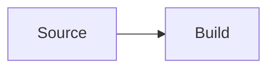

# CarlStack

李卡爾的系統工程與 AI 工程實戰筆記。CarlStack 是內容優先的繁體中文技術 Blog：文章與專案資料保存在 Git repository，以 Markdown／MDX 編輯，輸出靜態 HTML，部署到 GitHub Pages。

第一版刻意不包含 CMS、資料庫、登入、會員、付費或自製留言服務。內容能被一般編輯器、Codex 與其他 AI Agent 直接修改，框架也不會成為內容的唯一出口。

## 技術架構

- Astro 7、TypeScript strict mode、Astro Content Collections
- Markdown、MDX、Shiki 與 Mermaid
- Pagefind build-time 靜態全文索引
- 靜態 HTML + GitHub Pages（無 SSR adapter）
- RSS、Sitemap、robots.txt、Open Graph、Twitter Card 與 JSON-LD
- Node 內建 test runner；Prettier 與 Astro Check
- GitHub Actions 驗證 pull request，並在 `main` 更新後自動部署

發布管線：`src/content` → schema 驗證 → Astro static build → Pagefind 索引 → `dist` → GitHub Pages。

## 系統需求

- Node.js 22.13 以上（CI 固定 22.17.1）
- pnpm 12.1.0
- 本地開發與 production build 不需要 GitHub 憑證

建議讓 Corepack 使用專案指定版本：

```bash
corepack enable
corepack prepare pnpm@12.1.0 --activate
pnpm install
```

## 本地啟動

```bash
cp .env.example .env
pnpm install
pnpm dev
```

開發伺服器預設為 `http://localhost:4321`。開發環境會顯示 draft，並明確標記為「草稿預覽」。Pagefind 必須先完成 production build；要驗證完整搜尋請執行 `pnpm preview`。

## 指令

| 指令           | 用途                                                       |
| -------------- | ---------------------------------------------------------- |
| `pnpm dev`     | 啟動 Astro 開發伺服器                                      |
| `pnpm build`   | 產生靜態網站與 Pagefind 索引                               |
| `pnpm preview` | 重新 build，使用 Astro 本地預覽 production 靜態輸出        |
| `pnpm check`   | Prettier、Astro／TypeScript、內容 schema、production build |
| `pnpm test`    | 執行日期、draft、taxonomy、系列與 SEO 測試                 |
| `pnpm format`  | 套用 Prettier                                              |

## 新增文章

在 `src/content/blog` 新增 `.md` 或 `.mdx`。可複製 `astro-content-site-draft.mdx`，先保留 `draft: true`：

```yaml
---
title: "文章標題"
description: "搜尋結果與社群分享會使用的摘要。"
publishDate: 2026-08-31
updatedDate: 2026-09-02 # 選填
draft: true
featured: false
tags:
  - 系統設計
series: 架構決策實戰 # 選填
seriesOrder: 1 # 選填；有值時 series 必填
cover: ../../assets/covers/example.webp # 選填
coverAlt: "圖片替代文字" # 有 cover 時必填
canonicalUrl: https://example.com/original # 選填；cross-post 才設定
repositoryUrl: https://github.com/CarlLee1983/example # 選填
---
```

欄位由 `src/content.config.ts` 驗證。正式發布前將 `draft` 改為 `false`、確認日期與描述，再執行 `pnpm check && pnpm test`。標籤與系列頁完全由已發布內容生成；標籤 URL 會做 Unicode NFKC、大小寫與分隔符正規化。

完整編寫規範見 [docs/content-guide.md](docs/content-guide.md)。

## 新增或修改專案

在 `src/content/projects` 新增 `.md` 或修改現有範例：

```yaml
---
name: Project name
description: "不依賴遠端即時數據的簡短說明。"
repositoryUrl: https://github.com/CarlLee1983/project
homepageUrl: https://project.example.com # 選填
status: 開源
featured: false
tags: [CLI, API]
startedAt: 2026-01-01 # 選填
cover: ../../assets/projects/project.webp # 選填
---
```

不要手動填 Star、下載數或最新版本，除非另行建立可驗證且有更新責任的資料流程。首頁只顯示 `featured: true` 的專案。

## 程式碼、圖片與 Mermaid

Shiki 會處理 fenced code block：

````markdown
```ts
export const value = 42;
```
````

一般圖片請放在 `public/images`，並用 HTML 指定尺寸，避免 Layout Shift：

```html

```

內容 cover 建議放在 `src/assets`，讓 Astro 圖片管線產生 responsive image。Mermaid 使用標準 fence：

````markdown

````

Mermaid 只在含文章內容的頁面載入，安全層級固定為 `strict`。很寬的程式碼、表格與圖表會在自身容器捲動，不會撐破手機版面。

## 正式網域與 canonical

`SITE_URL` 是唯一的正式站址設定。未設定時使用保留的 `https://carlstack.example`，因此本地與 CI 在沒有網域時仍能 build；正式部署前必須設定：

```bash
SITE_URL=https://blog.your-domain.com pnpm build
```

GitHub deployment workflow 使用 repository/environment variable `SITE_URL`。Astro 會用它產生 canonical、RSS、Sitemap、Open Graph URL 與 robots.txt。不要在頁面元件硬編測試網域。

### Hashnode、Medium 等 cross-post

CarlStack 預設把自有網站設為 canonical。先在 CarlStack 發布原文，再同步到外部平台，並在外部平台把 canonical 指回 CarlStack。只有當 CarlStack 文章本身不是原始來源時，才在 frontmatter 設定 `canonicalUrl`；這個欄位會覆寫該篇文章的 canonical。

## 部署到 GitHub Pages

Repository 的 Pages source 設為 GitHub Actions，正式網址由 repository variable `SITE_URL` 提供。每次 push 到 `main` 時，deployment workflow 會執行 `pnpm check` 與 `pnpm test`，再上傳 `dist` 並部署；也可以從 Actions 頁面手動執行。

部署完成後確認 `/`, `/rss.xml`, `/sitemap-index.xml`, `/robots.txt` 與 `/search/`。GitHub Pages deployment 不需要額外 secrets。

### 綁定自訂網域

CarlStack 使用 `carlstack.gravito.dev`。GitHub Pages 設定此 custom domain 後，在 DNS 加入 `CNAME carlstack → carllee1983.github.io`；若使用 Cloudflare proxy，可先設為 DNS only，等 GitHub 核發 HTTPS 憑證後再決定是否開啟。綁定後檢查 canonical 與 Sitemap 是否使用正式網域。

## Giscus

Giscus 預設完全關閉。先在 GitHub repository 啟用 Discussions、安裝 Giscus app，於 [giscus.app](https://giscus.app/zh-TW) 取得設定，再填入四個公開 build variables：

- `PUBLIC_GISCUS_REPO`
- `PUBLIC_GISCUS_REPO_ID`
- `PUBLIC_GISCUS_CATEGORY`
- `PUBLIC_GISCUS_CATEGORY_ID`

四個值缺任何一個都不載入 Giscus，也不會讓 build 失敗。留言以 pathname 對應 Discussion。

## Cloudflare Web Analytics

優先在 Cloudflare Dashboard 對站點啟用 Web Analytics；這不需要修改程式碼。若要使用 beacon token，設定 `PUBLIC_CF_ANALYTICS_TOKEN`。未設定時不載入 analytics script；專案不加入 Cookie-based tracking。

## GitHub Actions

- `.github/workflows/ci.yml`：所有 pull request 執行 frozen install、`pnpm check` 與 `pnpm test`。
- `.github/workflows/deploy.yml`：push 到 `main` 或手動觸發時先驗證，再部署到 GitHub Pages。

## 常見問題

### 搜尋頁顯示「索引尚未產生」

`pnpm dev` 不會建立 Pagefind 資料。執行 `pnpm build` 後用 `pnpm preview` 開啟 `dist/pagefind`。

### production 看不到草稿

這是預期行為。使用 `pnpm dev` 預覽 draft；要發布時將 frontmatter 的 `draft` 改為 `false`。

### build 顯示 coverAlt 驗證錯誤

有 `cover` 的文章必須有具體 `coverAlt`。純裝飾圖也應重新判斷是否需要成為 cover，而不是填空字串。

### canonical 還是 `.example`

正式 build 沒有取得 `SITE_URL`。確認 shell、GitHub variable 或 deployment environment 有設定，然後重新 build；這是 build-time 設定，不是部署後即時變數。

### GitHub Pages 顯示 404 或自訂網域無法連線

確認 Pages source 是 GitHub Actions、deployment workflow 已成功，且 DNS 的 `carlstack` CNAME 指向 `carllee1983.github.io`。DNS 與 HTTPS 憑證生效前可能需要等待。

### Mermaid 沒有顯示

確認 fence 語言是小寫 `mermaid`，並查看瀏覽器 console 是否有語法錯誤。若站點另加嚴格 CSP，需要允許 Astro 輸出的同源模組；Pagefind 的 WASM／worker 也可能需要 `wasm-unsafe-eval` 與 `worker-src 'self' blob:`。
