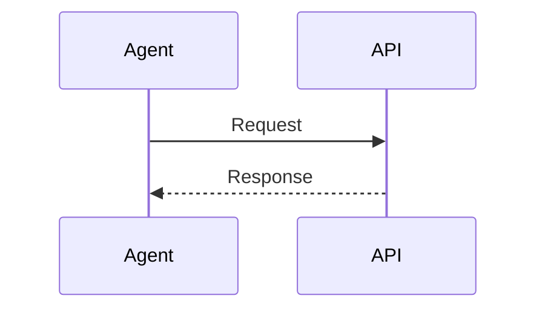

# CarlStack 內容指南

## 寫作定位

讀者是需要把系統與 AI 工程落地的工程師。文章應說清楚限制、選擇、驗證方式與結果；避免只有工具清單、抽象口號或無法重現的結論。

## 檔案與 URL

- 文章放在 `src/content/blog`，使用小寫 ASCII 檔名與連字號，例如 `agent-evaluation-loop.mdx`。
- 檔名會成為 `/blog/<slug>/`；發布後不要任意更名。
- 專案放在 `src/content/projects`。頁面從 collection 讀取，不修改 `projects/index.astro` 增加資料。

## Blog frontmatter

| 欄位            | 必填     | 說明                              |
| --------------- | -------- | --------------------------------- |
| `title`         | 是       | 頁面 h1、搜尋與 SEO title         |
| `description`   | 是       | 一到兩句具體摘要                  |
| `publishDate`   | 是       | ISO 日期；決定倒序排列            |
| `updatedDate`   | 否       | 有實質更新才設定                  |
| `draft`         | 是       | production 排除 `true`            |
| `featured`      | 是       | 是否進入首頁精選                  |
| `tags`          | 是       | 由內容生成 taxonomy，可為空陣列   |
| `series`        | 否       | 系列名稱                          |
| `seriesOrder`   | 否       | 正整數；設定時必須同時有 `series` |
| `cover`         | 否       | `src/assets` 相對圖片路徑         |
| `coverAlt`      | cover 時 | 描述圖片傳達的資訊                |
| `canonicalUrl`  | 否       | 只有本站不是原始來源時覆寫        |
| `repositoryUrl` | 否       | 本文對應 repository               |

日期不要加引號也可以；schema 會轉成 `Date` 並在格式錯誤時讓 check/build 失敗。

## 標籤與系列

重用既有詞彙，避免只差大小寫、全形或空格的同義標籤。URL 正規化會執行 NFKC、轉小寫、把非字母數字區段改為 `-`。中文會保留。

建議起始主題：AI 工程化、AI Agent Workflow、系統設計、API 整合、DDD 與 Clean Architecture、開源專案、技術選型、專案復盤。這份清單只提供作者選詞；網站顯示的 taxonomy 仍完全來自已發布文章。

系列文章應設定連續 `seriesOrder`。頁面依此欄位排序，未設定 order 的同系列內容會排在最後。

## Markdown 與 MDX

- 一篇文章只使用一個 h1；frontmatter title 會輸出 h1，正文從 `##` 開始。
- 程式碼 fence 要標示語言，讓 Shiki 正確高亮。
- Markdown 表格只用於真正的欄列資料；手機會在表格自身橫向捲動。
- MDX 只在 Markdown 表達力不足時使用，避免把文章寫成前端應用。

## 圖片

正文靜態圖片放 `public/images`，使用明確 width／height：

```html

```

首屏主要圖片不要 lazy-load。下方圖片使用 `loading="lazy"`。需要多尺寸輸出的 cover 放 `src/assets`，在 schema 中使用 image metadata；不要把遠端圖片 URL 當長期依賴。

## Mermaid

````markdown

````

Mermaid 以 `securityLevel: strict` 在瀏覽器渲染。避免在節點中加入 HTML；複雜圖請拆小，讓手機讀者可局部捲動。

## draft 到發布

1. 新檔設 `draft: true`。
2. `pnpm dev` 檢查內容、程式碼、圖片、Mermaid、深淺色與手機版。
3. 執行 `pnpm format && pnpm check && pnpm test`。
4. 設定正確 `publishDate`，將 `draft` 改為 `false`。
5. 再次執行 production build，確認文章出現在 RSS、Sitemap 與 Pagefind。
6. merge 到 `main` 後由 GitHub Actions 自動部署。

## SEO 與 cross-post

title、description 與 cover 會生成 Open Graph、Twitter Card；BlogPosting JSON-LD 使用發布／更新日期、作者、標籤與 canonical。沒有 cover 時使用 `public/social-card.png`。

先發布 CarlStack 原文，再同步到 Hashnode 或 Medium，並在外部平台設定 CarlStack URL 為 canonical。若內容原先發布在其他自有來源，才在 CarlStack frontmatter 設 `canonicalUrl` 指回該來源。

## 內容驗收

- 標題能單獨說明問題，不使用「終極」、「革命性」等無證據修飾。
- 摘要包含具體技術範圍與讀者會得到的結果。
- 每個外部事實有可追溯來源；時間敏感數據標示日期。
- 程式碼可以執行，或清楚標示為縮寫／概念片段。
- 圖片與 Mermaid 在 320 px 寬度不造成整頁水平捲軸。
- 草稿不會出現在 production build。
