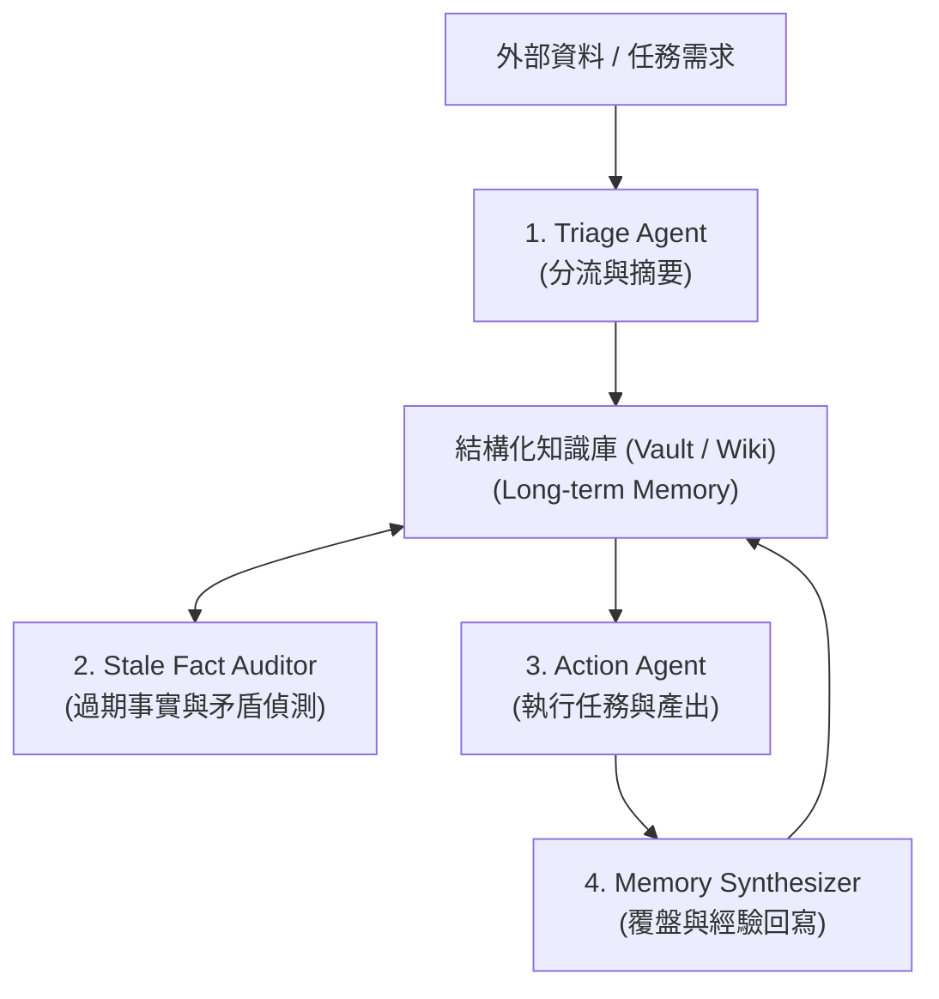

# 會行動的第二大腦與具記憶的 Agent 團隊：研究筆記

> 研究日期：2026-08-31（Asia/Taipei）
> 分析對象：[@rvaniaaaa 的 X 貼文](https://x.com/rvaniaaaa/status/2094035746369749246) 關於「主動知識庫（Active Second Brain）」與「多 Agent 持續學習迴圈」的實踐方案，並結合 LLM Wiki、Vectorless RAG 與組織記憶架構進行工程核對。

## 結論

傳統「第二大腦（Second Brain）」多停留在靜態的筆記歸檔（Passive Filing），最終常因維護成本過高或缺乏行動力而荒廢。

結合 AI Agent 團隊後，第二大腦轉型為**具備行動力與長期記憶的自組織系統（Active Knowledge System）**：

1. **角色分工（Role Specialization）**：劃分收集分流（Triage）、過期事實稽核（Stale Fact Detector）、執行行動（Action Worker）與複利回寫（Memory Synthesizer）。
2. **持續學習閉環（Continuous Learning Loop）**：執行成果與失敗覆盤自動回寫至結構化知識庫，讓後續 Agent 共享歷史經驗。
3. **主動維護機制**：定期主動掃描知識庫中的邏輯矛盾、陳舊資訊與斷裂連結，維持知識資產的高訊噪比。

---

## 系統架構：主動知識庫與 Agent 協同

---

## 參考資料

- [@rvaniaaaa — Active Second Brain & Agent Memory](https://x.com/rvaniaaaa/status/2094035746369749246)
- [Andrej Karpathy — Dynamic LLM Wiki Pattern](https://github.com/karpathy)
- [Anthropic — Effective context engineering for AI agents](https://www.anthropic.com/engineering/effective-context-engineering-for-ai-agents)
