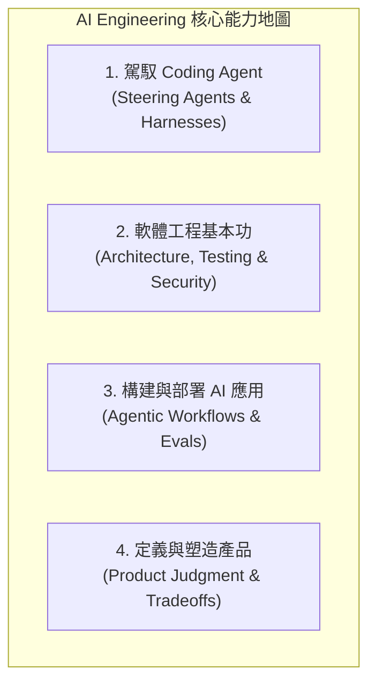

# Agentic Coding 與軟體工程基本功：研究筆記

> 研究日期：2026-08-31（Asia/Taipei）
> 分析對象：[Andrew Ng（吳恩達）的 X 貼文](https://x.com/andrewyng/status/2093388974194872781) 與 DeepLearning.AI 發布的「AI Engineering Skills Map」，核對 AI Agent 普及對軟體工程師核心能力維度的重塑。

## 結論

AI Agent 與「Agentic Coding」徹底改變了程式碼產出的邊際成本，但並未否定軟體工程（Software Engineering）的基本功。

相反地，隨著「Vibe Coding」快速產出原型，真正的瓶頸從「撰寫代碼」轉移為「如何將 Demo 推向可靠、可維護的生產級系統」。Andrew Ng 提出的「AI Engineering Skills Map」清晰標記出工程師的核心能力轉型：從記憶語法與樣板代碼，轉向**系統架構設計、自動化驗證、Agent 駕馭與工程權衡判斷**。

---

## AI Engineering Skills Map 四大能力支柱

| 能力支柱                 | 傳統工程時代                   | Agentic 時代的核心內涵                                         |
| ------------------------ | ------------------------------ | -------------------------------------------------------------- |
| **1. 駕馭 Coding Agent** | 僅依賴 IDE 補全 (Autocomplete) | 建立任務契約、設計 Context 邊界、多 Agent 協同與 Worktree 隔離 |
| **2. 軟體工程基本功**    | 手動刻寫每一行 CRUD 與樣板     | 系統架構設計、深模組接縫、自動化測試（TDD）、安全性與併發治理  |
| **3. 構建 AI 應用**      | 單次 Prompt + Completion       | 設計多步自主迴圈（Loops）、工具介面、RAG 與系統化 Evals 評估   |
| **4. 產品與工程判斷**    | 依照 PM 規格死板刻代碼         | 釐清模糊需求、定義不可變條件（Invariants）、權衡延遲與成本     |

---

## 貶值 vs. 升值的工程能力

- **邊際價值下降的能力**：語法細節死記硬背、框架樣板代碼搬運、手動重複性重構。
- **邊際價值激增的能力**：
  1. **可驗證性架構（Verifiability）**：懂得如何寫出能讓 Agent 自動驗證的測試套件；
  2. **模組接縫與邊界設計（Seam Design）**：懂得如何拆分系統讓 Agent 互不干擾並行開發；
  3. **系統性除錯與遙測（Systematic Diagnosis & Telemetry）**：懂得快速定位語意漂移與非確定性故障。

---

## 參考資料

- [Andrew Ng — AI Engineering Skills Map](https://x.com/andrewyng/status/2093388974194872781)
- [DeepLearning.AI — Agentic Design Patterns](https://www.deeplearning.ai/)
- [Anthropic — Building Effective AI Agents](https://www.anthropic.com/engineering/building-effective-agents)
