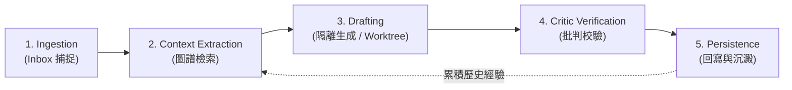

# Claude、Obsidian 與 Loop Engineering：研究筆記

> 研究日期：2026-08-31（Asia/Taipei）
> 分析對象：[@polydao 的 X 貼文](https://x.com/polydao/status/2094307289280716815) 所提出的「Claude + Obsidian + Loop Engineering」架構，並結合知識管理、檔案狀態機與 Agentic Workflow 實踐進行工程核對。

## 結論

將 Obsidian Vault 當作 AI Agent（如 Claude Code）的持久化狀態儲存層（Persistence / State Layer），並以自動化迴圈（Loop）取代單次對話視窗，是解決個人知識管理（PKM）維護負擔與 AI 遺忘／上下文膨脹的有效架構。

核心價值在於「**Human mostly reads, LLM mostly writes**」的心智模型轉變：人類定義規則與核心決策，Agent 在受控迴圈中完成資料收集、關聯抽取、草稿轉換與持續維護。然而，此架構必須具備明確的「耐用層／暫存層」隔離、Git 版本控制保護與確定性檢查，避免出現「幻覺反向污染知識庫」與「無效迴圈無限運轉」。

---

## 核心主張與技術核對

| 主張 / 概念                          | 核對結果                                                                                                                                                                                                  | 可安全採用的工程表述                                                                                             |
| ------------------------------------ | --------------------------------------------------------------------------------------------------------------------------------------------------------------------------------------------------------- | ---------------------------------------------------------------------------------------------------------------- |
| **聊天視窗無法累積複利**             | **完全支持。** 聊天視窗以 Session 為單位，Context Window 滿了即需 compact 或重開；歷史對話是非結構化的暫存，無法自然沉澱為可供後續任務精準調用的長期知識資產。                                            | 將對話視窗定位為「執行介面」，將本地 Markdown 檔案庫定位為「狀態與記憶層」。                                     |
| **Obsidian 作為 Write API / 狀態機** | **高度可行。** Obsidian 的純文字 Markdown 與 YAML Frontmatter 本質即是檔案系統資料庫；檔案為節點（Nodes），Frontmatter 與 Wikilinks（`[[]]`）即為具型別的圖譜邊緣（Edges），非常適合 CLI/Agent 直接讀寫。 | 建立明確的 Frontmatter Schema 與目錄結構，讓 Agent 能以確定性的規則進行檔案檢索與寫入。                          |
| **Loop Engineering（迴圈工程）**     | **有效實踐模式。** 超越一次性 prompt 互動，將任務設計為具備觸發、抽取、處理、審查與持久化回寫的閉環管線（Pipeline）。                                                                                     | 將知識維護拆解為「收集 → 上下文檢索 → 隔離生成 → 批判校驗 → 沉澱寫入」五步迴圈。                                 |
| **完全無人自轉的知識庫**             | **需嚴格限制範圍。** 若無保護機制，Agent 可能產生無效連結（幻覺 Backlinks）、覆蓋人類關鍵手寫筆記，或在邊界條件下無限消耗 Token。                                                                         | 導入「耐用層（Durable）」與「暫存/草稿層（Disposable）」分流，搭配 Git Worktree 與機械式 Reviewer 進行邊界防護。 |

---

## 系統架構：五步自動化知識迴圈

### 1. Ingestion（接收與收集）

- 原始素材（文章、逐字稿、隨筆、PDF）統一丟入緩衝區（如 `00-inbox/`）。
- 格式寬容，不要求人類在輸入當下就完成標籤與分類。

### 2. Context Extraction（上下文與關聯抽取）

- Agent 依據主題、關鍵字與現有 Vault 索引，檢索既有的相關筆記與 Frontmatter 標籤。
- 提取「已建立的實體」、「已有共識的術語」與「關聯主題」，避免孤島筆記或術語發散。

### 3. Drafting in Isolation（隔離草稿生成）

- Agent 透過工具在獨立工作區（如 `_drafts/` 或 Git Worktree）進行結構化整理與 Markdown 生成。
- 不直接原地覆寫正式筆記，降低執行失敗時的污染風險。

### 4. Critic Verification（批判性校驗）

- 由獨立的校驗機制（如 Critic Prompt、Subagent 或靜態檢查腳本）進行查核：
  - Frontmatter 是否符合 Schema 定義？
  - Wikilinks 是否指向不存在或拼寫錯誤的節點？
  - 摘要是否偏離來源事實？是否有未說明的推論？

### 5. Persistence & Compounding（持久化與複利回寫）

- 通過檢查的內容正式移入 Vault 知識節點目錄（如 `01-notes/` 或 `02-cards/`）。
- 歸檔 Ingestion 素材，並在日誌（Session Log / Changelog）留下紀錄，形成可供下一輪迴圈讀取的歷史脈絡。

---

## 關鍵設計原則：Durable Layer vs. Disposable Layer

為了平衡 Agent 的自動化能力與知識庫的真實性，必須嚴格切分雙層架構：

1. **耐用層（Durable Layer - 人類擁有）：**
   - 核心原則、個人決策、一手經驗與關鍵架構。
   - 只有人類可進行破壞性修改；Agent 僅可提出建議（PR / Diff）或在明確指定區域進行 Append。
2. **暫存/處置層（Disposable Layer - Agent 擁有）：**
   - Ingestion 緩衝、自動摘要、中間索引、關聯建議、每日任務清單。
   - Agent 可自由覆寫、重建或清理，即使丟失也不影響核心知識本體。

---

## 工程防護與失敗模式

1. **幻覺連結污染（Link Pollution）：**
   - _風險_：Agent 隨意包裹 `[[不存在的概念]]`，導致 Obsidian 圖譜出現大量空節點與無效關聯。
   - _對策_：要求 Agent 在生成 Wikilink 前必須先執行檔案存在性檢索，或限制只能引用既有索引中的詞彙。
2. **覆寫衝突與資料遺失：**
   - _風險_：直接寫入現有筆記時洗掉人類手寫註記。
   - _對策_：底層綁定 Git 版本控制；原則上「只新增（Append-only）或分檔存放」，禁止無確認的原地覆寫。
3. **上下文爆炸與 Token 消耗：**
   - _風險_：每次執行都試圖把整個 Vault 讀入 Context。
   - _對策_：依賴階層式目錄、MOC（Map of Content）與 Frontmatter 輕量索引進行按需檢索（Just-in-time retrieval）。

---

## 參考資料

- [@polydao — Claude + Obsidian + Loop Engineering 原始推文](https://x.com/polydao/status/2094307289280716815)
- [Anthropic — Effective harnesses for long-running agents](https://www.anthropic.com/engineering/effective-harnesses-for-long-running-agents)
- [Anthropic — Effective context engineering for AI agents](https://www.anthropic.com/engineering/effective-context-engineering-for-ai-agents)
- [Andrej Karpathy — LLM OS and dynamic wiki pattern](https://github.com/karpathy)
