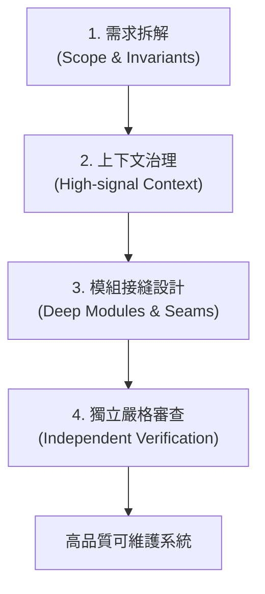

# 盡職程式設計（Due Diligent Programming）：研究筆記

> 研究日期：2026-08-31（Asia/Taipei）
> 分析對象：[@jowaywang 的 X 貼文](https://x.com/jowaywang/status/2093682461737967822) 關於 AI Coding 時代個體產出差異來源的論述，並結合現代軟體工程、Agentic Workflow 與審查責任進行技術核對。

## 結論

在基礎模型能力（LLM）逐漸平民化、人人皆可使用頂級代碼生成模型的背景下，工程師之間的實質交付產出與系統穩定度並未拉平，反而出現更大的個體差異。

產出差距的核心來源並非「打字速度」或「提示詞密技」，而是工程師是否落實**「盡職程式設計（Due Diligent Programming）」**：

1. **需求拆解與邊界契約（Decomposition & Contract）**：將模糊構想轉化為具備不可變條件（Invariants）與驗收標準的具體子任務。
2. **架構判讀與模組接縫（Architectural Judgment & Seams）**：評估 AI 產出架構的演進成本，設計深模組（Deep Modules）隱藏複雜度。
3. **獨立審查與邊界驗收（Independent Review & Verification）**：拒絕盲目合併（No Blind LGTM），以測試、型別與機械式工具驗證極端案例。
4. **上下文治理（Context Governance）**：為 Agent 提供高訊號、低噪音的專案知識與工具介面。

---

## 核心主張與技術核對

| 主張 / 概念                              | 核對結果                                                                                                               | 可安全採用的工程表述                                                     |
| ---------------------------------------- | ---------------------------------------------------------------------------------------------------------------------- | ------------------------------------------------------------------------ |
| **AI 讓平庸者更快產出技術債**            | **完全支持。** 若無架構約束與審查，代碼生成速度越快，技術債（Tech Debt）堆積越快；系統複雜度呈指數上升。               | 將 AI 當作高通量執行器，工程師必須承擔架構約束與代碼質量守門人的責任。   |
| **個體產出差異的根源在需求拆解**         | **完全支持。** 模糊需求導致 AI 產生大量無效推論與反覆修改；高產出工程師擅長以小步迭代、單一責任進行任務隔離。          | 「高槓桿來自於精準的輸入範圍（Scope）與明確的非目標（Non-goals）。」     |
| **代碼審查不能依賴 AI 自我證明**         | **完全支持。** 自我驗證存在盲點（Self-reinforcing bias）；必須仰賴獨立的測試、靜態分析與人類審查。                     | 採用「Writer-Reviewer 角色分離」與確定性的自動化測試套件作為驗收門檻。   |
| **工程師的價值從寫 Code 轉向審查與建模** | **高度成立。** 軟體工程的核心本來就是「問題抽象」與「權衡取捨」；AI 承擔實作細節後，領域建模與系統設計的價值更加凸顯。 | 工程師的核心技能升級為：領域建模、介面設計、失敗模式預判與可驗證性架構。 |

---

## 盡職工程師的四項核心責任

### 1. 需求拆解與契約化

- 定義明確的 Pre-conditions、Post-conditions 與 Invariants。
- 明訂「非目標（Non-goals）」，防止 Agent 自作主張擴展功能邊界。

### 2. 上下文治理與環境防護

- 避免將混亂的對話歷史直接丟給模型。
- 提供乾淨的 API 規格、型別定義與最小重現測試案例。

### 3. 模組接縫與架構把關

- 辨識淺模組（Shallow Modules，介面繁複但邏輯薄弱）與過度工程。
- 確保新增功能落在正確的邊界內，維持系統整體的低耦合與高內聚。

### 4. 獨立審查與機械式驗證

- 檢查併發競態（Race Conditions）、記憶體洩漏、邊界條件與錯誤處理路徑。
- 拒絕沒有測試證據的 PR；將驗收標準交給 CI 與測試執行器而非語言模型口頭保證。

---

## 參考資料

- [@jowaywang — AI Coding 時代的個體產出差異原始推文](https://x.com/jowaywang/status/2093682461737967822)
- [Anthropic — Building Effective AI Agents](https://www.anthropic.com/engineering/building-effective-agents)
- [John Ousterhout — A Philosophy of Software Design (Deep Modules)](https://web.stanford.edu/~ouster/cgi-bin/book.php)
