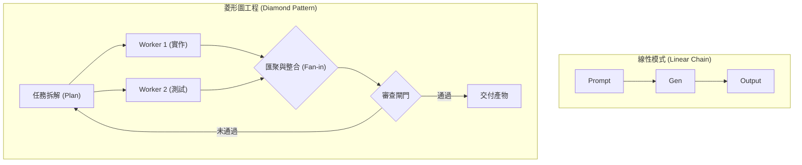

# Graph Engineering：研究筆記

> 研究日期：2026-08-31（Asia/Taipei）
> 分析對象：[@anatolikopadze 的 X 貼文](https://x.com/anatolikopadze/status/2080668775796314331) 所提出的「Graph Engineering」框架，並對比線性 Chain、DAG（有向無環圖）與狀態機（State Graph）在 AI Agent 系統中的適用邊界。

## 結論

「Graph Engineering」是從單一線性提示詞（Linear Chain-of-Thought / Sequential Pipelines）邁向複雜自主 Agent 系統的核心架構思維。

將 Agent 工作流程建模為「圖（Graph）」，能妥善處理**平行展開（Fan-out）、條件分支（Branching）、菱形匯聚（Diamond Fan-in）與受控回饋迴圈（Cyclic Retry）**。然而，圖結構並非萬靈丹；若在簡單或線性任務中濫用圖工程，會導致協調開銷過大、延遲激增與 Token 成本失控。

---

## 線性鏈條 vs. 圖工程（Graph Engineering）

| 維度             | 線性鏈條（Linear Chains）            | 圖工程（Graph Engineering）                      |
| ---------------- | ------------------------------------ | ------------------------------------------------ |
| **拓撲結構**     | 單向線性步驟（A → B → C）            | 有向圖（DAG 或含條件迴圈的 State Graph）         |
| **執行效率**     | 循序阻塞，無法平行化                 | 互不相依的節點可平行並行（Fan-out）              |
| **錯誤處理**     | 中間步驟失敗即全鏈中斷或沿途積累錯誤 | 具備局部重試、降級路徑（Fallback）與獨立驗證閘門 |
| **複雜度與成本** | 低 Token 開銷、易除錯、低延遲        | 較高協調成本、狀態同步需嚴格治理                 |
| **最佳適用場景** | 單純轉換、單一檔案小修改、明確指令   | 多面向研究、多模組獨立重構、複雜審查與代碼整合   |

---

## 經典圖拓撲模式

1. **菱形模式（Diamond Pattern / Fan-out & Fan-in）**：
   - 入口將任務拆解為多個無依賴的獨立領域（如前端 UI、後端 API、測試案例）。
   - 多個 Subagents 同步並行開發。
   - 在 Join 節點由整合者進行衝突檢查與跨模組整合。
2. **審查回饋迴圈（Cyclic Verification Loop）**：
   - 包含明確的重試次數上限（Max Retries）與跳出機制（Escalation Policy），避免無限死迴圈。

---

## 何時使用 vs. 何時不用

### 適合使用 Graph Engineering 的時機：

- 任務存在天然的正交子問題（可平行展開節省時間）。
- 產物需要多維度獨立審查（如安全性檢查、效能分析、代碼風格分別由不同特化 Agent 評估）。
- 需要根據中間步驟的評估結果動態決定下一條分支路徑。

### 應避免使用（過度工程）的時機：

- 簡單的單一檔案修改或低風險 Bug 修復。
- 具有強烈前後因果相依、無法平行的線性流程。
- 對延遲極度敏感、預算受限的互動式場景。

---

## 參考資料

- [@anatolikopadze — Graph Engineering 原始推文](https://x.com/anatolikopadze/status/2080668775796314331)
- [Anthropic — Building Effective AI Agents (Workflows vs Agents)](https://www.anthropic.com/engineering/building-effective-agents)
- [LangChain / LangGraph — Architectural Concepts of State Graphs](https://langchain-ai.github.io/langgraph/)
