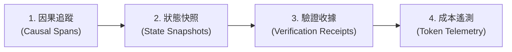

# Trace Engineering：研究筆記

> 研究日期：2026-08-31（Asia/Taipei）
> 分析對象：[@marfinxx 的 X 貼文](https://x.com/marfinxx/status/2094016175617241109) 與相關討論提出的「Trace Engineering / Agent 可觀測性」架構，並結合 OpenTelemetry、分散式追蹤與 LLM Agent 運作特性進行工程核對。

## 結論

傳統微服務的可觀測性（Logs, Metrics, Traces）不足以應對自主 AI Agent 的非確定性與多輪推理特性。

「Trace Engineering」是將可觀測性提升為 Agent 控制系統的關鍵架構，核心在於四個維度：

1. **因果追蹤（Causal Lineage）**：記錄推理意圖、工具呼叫、決策分支與狀態變更的完整因果鏈條。
2. **故障重播（Fault Replay）**：完整快照 Prompt、工具回傳與環境狀態，使非確定性錯誤可被重現與除錯。
3. **驗證收據（Verification Receipts）**：將測試結果、靜態分析與人工核准掛載至 Trace 上作為交付憑證。
4. **成本與效率遙測（Token & Cost Telemetry）**：監控每輪次 Token 消耗、模型延遲、快取命中率與單位任務成本。

---

## 核心主張與架構核對

| 主張 / 概念                       | 核對結果                                                                                                                 | 可安全採用的工程表述                                                       |
| --------------------------------- | ------------------------------------------------------------------------------------------------------------------------ | -------------------------------------------------------------------------- |
| **Log 不足以除錯 Agent**          | **完全支持。** 一般文字日誌缺乏階層因果關係，無法看清 Agent 究竟是因為哪一次工具回傳的微小偏差而導致後續幾輪的嚴重幻覺。 | 建立樹狀 Span 與狀態快照，將推理、工具與狀態轉換綁定。                     |
| **Trace 是無人值守的信任基石**    | **完全支持。** 若無端到端可追蹤性，無法在背景放手執行長任務。                                                            | 「Trace every run, add verification gates, and verify receipts.」          |
| **故障可重播性（Replayability）** | **高度可行。** 將外在環境的非確定性（API、時間、隨機性）在 Trace 中固化，即可進行確定性的回歸測試。                      | 把每次失敗的 Trace 轉換為 E2E 測試案例，防止模型或 Prompt 更新後再次踩坑。 |

---

## Trace Engineering 架構四支柱

---

## 參考資料

- [@marfinxx — Trace and Observability for AI Agents](https://x.com/marfinxx/status/2094016175617241109)
- [OpenTelemetry — Semantic Conventions for Generative AI Systems](https://opentelemetry.io/docs/specs/semconv/gen-ai/)
- [Anthropic — Effective harnesses for long-running agents](https://www.anthropic.com/engineering/effective-harnesses-for-long-running-agents)
