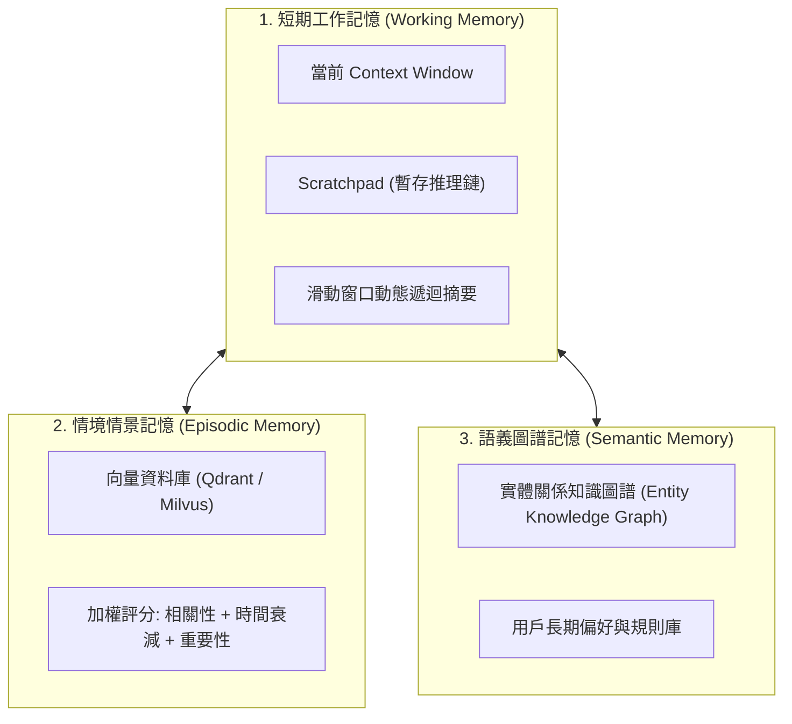

import AiAgentStateMachineSandboxDiagram from "../../components/AiAgentStateMachineSandboxDiagram.astro";

從單次對話的 LLM Chatbot 走向能夠自主拆解複雜任務、調用外部工具、自我反思與糾錯的 **AI Agent（智慧體）**，是 AI 工程化的最大範式轉移。

然而，許多初期 Agent 專案往往陷入兩個極端：

- **玩具級失控**：單純依賴一個巨大的 Prompt 讓 LLM 自主思考，結果頻繁陷入「死循環（Infinite Loops）」、發起危險的系統指令或丟失歷史上下文；
- **過度僵化**：寫死成硬編碼的 if-else 流程圖，完全失去了 LLM 面對未知情境時的靈活推理能力。

建構高可靠度生產級 Agent 的核心在於：**以有限狀態機（FSM / StateGraph）為骨架，以 ReAct 認知循環為驅動，以多層記憶工程為支撐，並以 MicroVM 安全沙盒為邊界**。

本文基於 Anthropic 官方指南 [Building Effective Agents](https://www.anthropic.com/research/building-effective-agents) 與 [ByteByteGo System Design 101](https://github.com/ByteByteGoHq/system-design-101)，深入剖析現代 AI Agent 的架構設計與實戰防護。

<AiAgentStateMachineSandboxDiagram />

---

## 一、Agent 決策架構的三代演進

| 架構模式                        | 核心機制                                   | 優勢                     | 致命短板                   |
| :------------------------------ | :----------------------------------------- | :----------------------- | :------------------------- |
| **1. Prompt Chaining**          | 線性順序執行（A ➔ B ➔ C）                  | 結構簡單、確定性極高     | 無法處理分支與意外錯誤     |
| **2. Router / Workflow DAG**    | 依意圖分類進入固定有向無環圖               | 易於除錯與監控           | 無法進行自適應動態探索     |
| **3. Autonomous State Machine** | 狀態機（FSM / StateGraph）+ 記憶與工具沙盒 | 能自主循環探索、自我修復 | 需嚴密的循環熔斷與沙盒防禦 |

---

## 二、認知決策循環：ReAct vs. Plan-and-Solve

### 1. ReAct 思考循環（Reason + Act + Observe）

2022 年 Yao 等人提出的 **ReAct 框架** 是現代 Agent 的標準範式：

```text
1. Thought: 評估當前目標與歷史進度，推導下一步行動。
2. Action: 選擇具體工具並生成結構化參數（如 query_database(sql=...)）。
3. Observation: 執行工具並獲取真實環境的返回結果（如錯誤日誌或查詢數據）。
4. (循環回 Thought，根據 Observation 修正策略直到完成任務)。
```

### 2. Plan-and-Solve（先規劃再執行）

對於長流程任務（如「重構整個代碼庫」），單純依賴 ReAct 容易「走一步看一步」而迷失方向。

**Plan-and-Solve** 將決策分為兩層：

1. **Planner（規劃器）**：首先輸出由多個子任務組成的依賴 DAG。
2. **Executor（執行器）**：針對每個子任務執行 ReAct 循環。
3. **Replanner（動態重排）**：當某一步驟執行失敗時，動態修正後續 DAG 節點。

---

## 三、死循環熔斷機制（Cycle Breaker）

LLM 在遇到工具返回錯誤時，容易產生「以相同參數重複調用同一工具」的幻覺死循環。生產級狀態機必須實施三道硬性防護：

```python
class AgentExecutionController:
    def __init__(self, max_steps=25):
        self.max_steps = max_steps
        self.action_history = []

    def check_safety(self, current_step, action_name, action_args):
        # 1. 最大步驟限制
        if current_step >= self.max_steps:
            raise MaxStepsExceededException("任務超過最大步數限制，觸發安全終止")

        # 2. 動作哈希重複檢測 (Duplicate Action Detection)
        action_hash = hash((action_name, json.dumps(action_args, sort_keys=True)))
        if self.action_history.count(action_hash) >= 3:
            raise InfiniteLoopDetectedException("偵測到連續 3 次完全相同的工具調用，觸發死循環熔斷")

        self.action_history.append(action_hash)
```

---

## 四、Agent 記憶工程架構（Memory Engineering）

Agent 的記憶體系必須劃分為三種生命週期不同的層級：



1. **短期工作記憶**：存放於 LLM 當前 Context Window 中。透過**滑動窗口（Sliding Window）**與**階層遞迴摘要（Hierarchical Summarization）**，將 100 輪對話動態壓縮為精華摘要，防止超出 Token 上限。
2. **情境記憶（Episodic Memory）**：記錄過去任務的成功與失敗案例。採用 Stanford 提出的人格 Agent 加權公式檢索：
   ```text
   Retrieval_Score = alpha * Relevance + beta * Recency + gamma * Importance
   ```
3. **語義知識圖譜**：儲存確定性的實體事實與使用者約束，杜絕向量檢索的語義模糊性。

---

## 五、工具執行安全沙盒：Firecracker 與 gVisor

當給予 Agent 執行代碼（如 Python / Bash）、讀寫檔案或訪問內網的能力時，**沙盒隔離（Sandboxing）** 是最後一道安全屏障。

### 1. 為什麼不能使用常規 Docker 容器？

標準 Docker 容器共享宿主機（Host）Linux Kernel。一旦 Agent 生成惡意指令（如內核漏洞利用、逃逸攻擊），整個宿主機將直接被攻陷。

### 2. 生產級 MicroVM 沙盒架構

- **AWS Firecracker / gVisor**：
  - **毫秒級冷啟動（< 5ms）**；
  - 獨立的輕量級虛擬機內核，系統調用（Syscall）嚴格攔截與過濾；
  - **唯讀 RootFS** + 記憶體臨時檔案系統（Tmpfs），任務結束後整機銷毀（Ephemeral Sandbox）。
- **網路白名單（Egress Control）**：嚴格封鎖私有內網網段（`10.0.0.0/8`, `192.168.0.0/16`），僅允許訪問授權的外部 API。

### 3. 雙向授權邊界（Human-in-the-Loop Approval）

對於可能造成不可逆後果的操作（如發送對外郵件、刪除資料庫、付款交易）：

- 狀態機進入 **`SUSPENDED`** 狀態；
- 向前端使用者拋出審批卡片（包含具體操作、參數與風險評估）；
- 使用者點擊「核准」後，狀態機攜帶簽名令牌恢復（Resume）執行。
