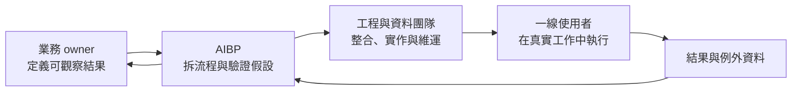

AI 導入很容易停在一次漂亮的 demo：模型能摘要文件、產生報表、回覆客戶，大家都同意「應該有用」，但隔週回到原本流程。這時不必先假定模型不夠好；更值得先檢查的是，是否有人對流程結果負責。

本文把 **AI Business Partner（AIBP）** 當成一個工作標籤：不坐在場邊培訓、不只做技術展示，也不只是往返於業務與工程之間的傳話者；而是待在業務線裡，持續把一項工作做得更快、更準或更可控的人。這不是既有標準職稱，也不是要每家公司另設一個職位。

真正要固定的是一條責任鏈：**誰定義業務結果、誰改造工作流、誰守住風險邊界、誰用資料判斷是否真的改善。** 各公司可以把它放在 AI 產品經理、營運轉型負責人、領域專家或工程 lead 身上。

## 先辨認問題：你缺的是模型，還是工作流 owner？

若團隊有以下現象，先把工作流 owner 納入診斷：

- 培訓後每個人都會問幾次模型，卻沒人把它放進日常工作；
- demo 很順，但真實資料、例外案件與核准流程一接上就卡住；
- 工程團隊完成工具後，業務端不知道何時該用、用錯怎麼退回；
- 導入成效只剩活躍人數、訊息量或 token，沒有營運結果。

OpenAI 的企業調查也呈現類似方向：較成熟的導入會把 AI 接進可重複的工作流，並同時處理知識／資料準備、評估、領導支持與變革管理；但這是供應商客戶資料與案例，不是每個組織都會得到同樣效果。[OpenAI《The state of enterprise AI》](https://openai.com/business/guides-and-resources/the-state-of-enterprise-ai-2025-report/)

因此，AIBP 的工作單位不是「部署一個模型」，而是一條有明確輸入、決策、產出與例外的業務流程。例如：從收到詢價到可提交報價、從客訴進站到人工核准的回覆，或從採購資料收齊到合規審查完成。流程有 owner，改善才有地方落地。

## AIBP 的邊界：不是什麼都自己做

把角色看成一條交接帶，比把它理解成全能的 AI 專家更實用：



業務 owner 決定「什麼改善值得做」與可接受的取捨；AIBP 將其轉成可測量流程與採用設計；工程與資料團隊負責可靠、安全地實作；一線人員則用真實案例暴露例外與摩擦。AIBP 不取代其中任何一方，卻必須讓這個迴路不斷運轉。

這也劃出幾個常被混淆的角色：

| 角色             | 主要交付                 | 不能替代的 AIBP 責任         |
| ---------------- | ------------------------ | ---------------------------- |
| 培訓／enablement | 使用者理解與基本能力     | 選定哪條流程、改變哪個結果   |
| AI 工程師        | 可運作的系統、整合與維運 | 現場流程、採用阻力與價值取捨 |
| AI 產品經理      | 產品問題、需求與 roadmap | 特定業務線的持續營運責任     |
| 顧問或專案經理   | 診斷、提案與協調         | 導入後每週查看結果並修正流程 |

一個人可以兼任多個角色；小團隊尤其常見。重點不是畫出更多 RACI，而是避免「所有人都參與，卻沒人承擔導入後結果」的空白。

## 從一條流程開始，而不是成立 AI 計畫

第一個切片要小到能看見改變，也要真到值得承擔。選題可以用四個問題過濾：

1. **結果能否量化？** 例如完成時間、退回率、漏填率、轉人工率或客戶等待時間。
2. **流程是否重複？** 一次性的策略討論不適合作為第一個自動化對象。
3. **例外是否可列舉？** 若連「何時不能交給 AI」都說不出來，就先做輔助，不做自動執行。
4. **是否有權改流程？** 沒有流程 owner 的同意，最後只會多一個旁路工具。

接著把流程寫成一張最小的實驗卡，而非長篇 AI 策略：

```yaml
workflow: 客訴初步分流
baseline: 首次分類平均 18 分鐘，人工覆核後退回率 12%
target: 在不提高退回率下，將首次分類時間降至 8 分鐘內
ai_scope: 摘要案件、擷取欄位、提出分類與回覆草稿
human_gate: 涉及退款、法規或高風險客戶時必須人工核准
evidence: 每週抽樣覆核、退回原因、處理時間與使用者回饋
owner: 客服營運主管
```

數字只是範例，關鍵在於 target 必須同時包含速度與品質。只追求「省下多少分鐘」，會鼓勵系統把難題轉給下一位人類；只看正確率，則可能忽略流程是否真的被採用。

## 讓指標包含例外與可逆性

AI 導入的 dashboard 不該只有使用量。至少同時看四組訊號：

| 面向 | 要問的問題                   | 可用訊號                               |
| ---- | ---------------------------- | -------------------------------------- |
| 結果 | 流程有沒有變好？             | 週期時間、完成率、退回率、客戶等待時間 |
| 品質 | 更快是否仍可接受？           | 抽樣覆核、錯誤類型、人工修正比例       |
| 採用 | 使用者是否真的把它放進工作？ | 有效使用率、繞過流程比例、回饋原因     |
| 風險 | 系統失誤時能否被發現與復原？ | 例外升級、撤回、權限拒絕、事件處理時間 |

NIST 的 AI Risk Management Framework 將風險工作整理為 Govern、Map、Measure、Manage 四個持續進行的功能。它不是待專案結束才填的合規清單，而很適合當作這張實驗卡的提醒：先界定情境與影響，持續量測，並把例外與風險回寫到流程設計中。[NIST AI RMF Core](https://airc.nist.gov/airmf-resources/airmf/5-sec-core/)

在實務上，這代表第一版優先提供建議與草稿，讓人可以改、退回或升級；當錯誤型態與效益都被量到，再討論擴大自動權限。把高風險決定留給人工 gate，不是導入失敗，而是可靠地縮小第一個問題。

## 每週做一次「流程 review」，不是只看模型評分

模型評分能幫忙，但它回答不了客戶是否等太久、使用者是否偷偷改回舊流程，或例外是不是全堆到同一位同事身上。AIBP 應固定和流程 owner 看一小段真實樣本：

- 哪些案件明顯更快、更完整？
- 哪些錯誤重複出現，根因是資料、規則、工具介面還是模型？
- 人工 gate 是否擋住了該擋的事，又是否造成新的排隊？
- 下一週要改一條規則、補一個資料欄位，還是停止這個切片？

這是把 AI 從「採購或功能」變成營運能力的關鍵。成功後才將有效的指令、資料契約、例外規則與評估樣本固化；沒有證據的假設則刪掉。不要先建一個覆蓋全公司的 agent 平台，因為一條尚未跑通的流程不會因為平台變大而突然有價值。

## 職稱可以不同，責任不能消失

AI Business Partner 是否成為主流職稱，並不影響眼前的工程決策。值得帶走的觀點是：模型能力與工具數量都不是導入的 owner。當一條業務流程能說清楚結果、權限、例外、證據與下一次 review，它才真正有機會持續改善。

若目前連一條流程都無法指定 owner，最小下一步不是再辦一次模型培訓，而是找一位有權改變工作方式的人，和他一起寫下第一張實驗卡。這比宣告「全面 AI 轉型」更小，也更接近可驗證的價值。若已在選擇 Bot、Skill、Routine 與審批機制，則可接著看 [如何把單一任務做成安全的長駐自動化](/blog/grok-bot-cloud-computer-workflows/)；那篇處理執行環境，本文處理誰持續擁有流程結果。

## 參考資料

- [使用者提供的原始 X 討論連結](https://x.com/KyrieCheungYep/status/2092102983018545544)（研究時無法擷取原文，未用於支撐外部事實）
- [OpenAI：The state of enterprise AI（2025）](https://openai.com/business/guides-and-resources/the-state-of-enterprise-ai-2025-report/)
- [NIST：AI RMF Core](https://airc.nist.gov/airmf-resources/airmf/5-sec-core/)
