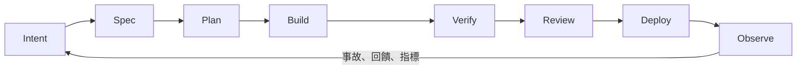

AI coding agent 能在幾小時內完成過去需要幾天的實作，不代表功能也能同樣快地進入 production。需求仍可能含糊，review queue 仍由人排隊處理，安全政策仍藏在文件裡，部署後的問題也不會自動變成下一輪測試。

這正是 AI Native SDLC 想處理的落差：不是在既有流程每一格加上一個 AI 按鈕，而是重新設計從意圖、實作、驗證到生產回饋的整條價值流。

Google、OpenAI、Anthropic 與 LangChain 最近分別從開發範式、團隊分工、企業流程與 Agent 產品生命週期切入。四份材料並不是同一套標準，也都帶有供應商立場；但把它們交叉閱讀，可以看出幾個比產品功能更穩定的共同方向。

## 加速實作，只會把瓶頸往兩側推

Google 的《The New SDLC with Vibe Coding》把 AI-assisted development 放在一條從 vibe coding 到 agentic engineering 的光譜上。差別不在有沒有使用模型，而在輸出周圍有多少規格、context、測試、限制與人工判斷。

Anthropic 的 [AI-Native SDLC Playbook](https://claude.com/blog/the-ai-native-sdlc-playbook)則直接指出：當 build 階段縮短後，plan、review／test 與 deploy 仍以人的速度運作，新的瓶頸就出現在實作之前與之後。若安全團隊與 review 能力沒有同步擴張，結果不是變更塞車，就是程式碼在較少檢查下進入 production。

因此，程式碼行數、Agent 完成次數或 PR 數量都不是好指標。真正該問的是：一個意圖到達可驗證、可部署的結果要多久？中間返工幾次？需要多少人工注意力？部署後又增加多少維護成本？

## 四份材料各自補上一塊

這四個來源的重點可以分成四個層次：

| 來源      | 主要問題                                         | 提出的工程重點                                        |
| --------- | ------------------------------------------------ | ----------------------------------------------------- |
| Google    | 如何從臨時 prompting 走向 production engineering | context、harness、驗證與依風險調整自治程度            |
| OpenAI    | 工程團隊如何重新分配人機責任                     | Delegate、Review、Own，以及把 Agent 用到完整 SDLC     |
| Anthropic | 企業流程如何讓 Agent 接續工作並留下稽核軌跡      | 版本化制品、Skills、hooks、approval gates 與回饋閉環  |
| LangChain | Agent 產品如何反覆發布並改善                     | Build、Test、Deploy、Monitor，以及 eval、trace 與治理 |

OpenAI 的 [Building an AI-native engineering team](https://cdn.openai.com/business-guides-and-resources/building-an-ai-native-engineering-team.pdf)把工作分成 Delegate、Review 與 Own。Agent 可以先做範圍清楚、可驗證的分析與實作；人負責檢查完整性；產品意圖、核心架構、風險接受與 production 責任仍必須有人擁有。這比籠統地說「human in the loop」更具體，因為它要求團隊說清楚人究竟在哪裡作判斷。

Anthropic 則把每個階段的輸出變成下一階段可讀的版本化制品：`intent.md`、spec、plan、程式碼與測試、PR 與審查紀錄，再到 production 事件。檔名不是重點；重點是意圖不只存在會議或聊天記錄裡，而且每次轉換都有可追溯輸入、產物與核准者。

LangChain 的 [Agent Development Lifecycle](https://www.langchain.com/blog/the-agent-development-lifecycle)處理的是另一種情況：正在開發的產品本身就是 Agent。它把流程整理成 Build → Test → Deploy → Monitor，並讓 production trace 回到下一輪資料集與 eval。傳統監控只能告訴你服務有沒有回傳錯誤；Agent 監控還要回答它是否用了正確工具、遵循必要步驟、取得正確 context，並真的完成任務。

## 新的主線是可接續的制品鏈

當自然語言成為主要輸入，意圖就不能只是一句「幫我做好」。一個能被 Agent 與人共同使用的最小意圖，至少要說明：

- 要改變哪個可觀察結果；
- 誰受到影響，以及為什麼值得做；
- 哪些限制、風險與非目標必須保留；
- 什麼證據能證明結果可接受。

接下來的 spec 與 plan 不是為了增加文件，而是要在大量程式碼產生前，先暴露依賴、架構衝突、安全邊界與驗證方式。此時修正方向通常比 review 一個巨大 diff 便宜。

這條鏈也改變 code review 的問題。Reviewer 不只檢查語法與局部實作，而是比較「原始意圖、接受的計畫、實際 diff 與驗證證據」是否一致。若實作偏離計畫，偏離本身就應被說明，而不是讓 reviewer 從程式碼反推原因。

## 普通軟體需要 tests，Agent 產品還需要 evals

一般軟體的核心行為多半可以用確定性測試描述：給定輸入後，輸出與狀態是否正確。Agent 產品除了最終答案，還有非確定性的執行路徑；同一任務可能有多種合理結果，也可能在回傳 HTTP 200 時選錯工具或跳過審批。

因此 LangChain 建議先用少量代表性任務建立資料集，在發布前比較 prompt、model、retrieval、tool schema 與 workflow；上線後再從 trace、人工回饋與已知失敗補強資料集。多輪 Agent 還需要模擬完整互動，而不只測單次回答。

不論普通軟體或 Agent 產品，都不該讓同一個生成者成為唯一驗證者。可執行測試、CI gate、獨立 review 與 production observation 各自提供不同證據；生成速度愈快，這些回饋面愈重要。

## 建議性知識與強制性控制要分開

Anthropic 的 playbook 區分了 Skills 與 hooks。Skill 告訴 Agent 應該怎麼完成安全審查、API 設計或發布流程；hook、sandbox、CI、身份系統與 branch protection 則限制它不能做什麼。

這個邊界不能只靠 Prompt 取代。不可讀取的憑證、不可修改的路徑、受限網路、production 部署核准與 audit log，都需要由模型之外的系統執行。Agent 可以準備變更、執行測試與提出部署建議，但高風險動作是否被授權，不能由同一個模型自行決定。

## 先修一條真實工作流，不必重做整家公司

AI Native SDLC 不需要一次建立多 Agent 平台。最小起點可以是一類低風險、常重複而且已有驗證方式的工作，例如文件更新、小型 bug fix 或依賴維護：

1. 把目標、限制與驗收條件寫成可版本控制的輸入。
2. 讓 Agent 先提交 plan，再依 plan 實作並執行既有 checks。
3. 只允許它建立 branch 或 PR，不直接跨越 production gate。
4. 記錄人工修改、失敗原因與 review 等待時間。
5. 把重複失敗變成測試、規則或新的工作項目。

這個切片若不能降低從意圖到可接受變更的時間，就先修 context、驗證或流程，不要急著增加 Agent 數量。並行只會增加在制品；真正的吞吐量仍受限於團隊能可靠驗證多少結果。

AI Native SDLC 的成熟度，不在於 Agent 能寫多少程式碼，而在於它出錯時，團隊能否及時發現、限制影響、追溯原因，並把同類失敗轉成下一輪不再重複的工程證據。
