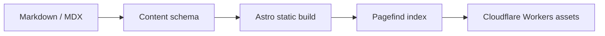

技術內容最耐用的格式通常不是資料庫裡的一筆記錄，而是可以被 Git、文字編輯器與任何建置工具讀懂的純文字。CarlStack 因此把文章留在 repository，讓發布流程只是把內容轉成靜態 HTML。

> 內容的原始檔要比網站框架活得更久；框架可以替換，Markdown 不必跟著重寫。

## 最小內容查詢

Content Collection 在建置前驗證 frontmatter，頁面只處理已通過 schema 的資料：

```ts
import { getCollection } from "astro:content";

const posts = (await getCollection("blog"))
  .filter((post) => !post.data.draft)
  .sort((a, b) => b.data.publishDate.getTime() - a.data.publishDate.getTime());
```

這段查詢仍會由專案內的共用函式統一執行，避免首頁、RSS 與標籤頁各自發明一套排序規則。

## 取捨表

| 選擇     | 第一版決策       | 原因                           |
| -------- | ---------------- | ------------------------------ |
| 內容儲存 | Markdown／MDX    | 可攜、可 diff、適合 Agent 編輯 |
| 輸出模式 | 靜態 HTML        | 不需要資料庫與常駐後端         |
| 搜尋     | Pagefind         | 索引隨 build 產生              |
| 留言     | Giscus，預設關閉 | 不維護自己的留言服務           |

## 圖片

下圖使用明確尺寸，瀏覽器在圖片載入前就能保留版面空間。


## Mermaid 架構圖



這個圖表在文章頁才載入 Mermaid；其他頁面不付出 JavaScript 成本。若圖表或程式碼很寬，容器會在手機上局部捲動，不會讓整個頁面產生水平捲軸。
