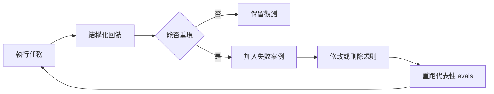

Coding Agent 用久後，常見的反應是把每次出錯都補進 `AGENTS.md` 或 `CLAUDE.md`：測試要跑哪些、哪些目錄不能碰、該參考哪個既有實作，以及什麼才算完成。久而久之，規則文件會同時包含有效護欄、程式碼已能推導的常識，以及早已失效的操作狀態。

[@PostHog 的〈Your AGENTS.md is holding you back〉](https://x.com/posthog/status/2094485724171223409)記錄了一個具體代價：團隊暫停 GitHub merge queue 後忘了同步更新 `AGENTS.md`，Agent 在 21 小時內持續依照錯誤指令工作。其中一個 PR 卡住 10 小時，另一位工程師花了 45 分鐘才定位到過期規則。PostHog 也在 [build mode 原文](https://newsletter.posthog.com/p/your-agentsmd-is-holding-you-back)保留完整案例與引用。

問題因此不只是 context 太長，而是規則文件已經成為一份沒有型別檢查、沒有更新通知，也沒有自動失效機制的快取。這篇文章從 PostHog 的案例出發，整理規則該放在哪裡、如何刪，以及如何用 evals 與執行回饋維護它。[上一篇談 Harness Engineering 的文章](/blog/harness-engineering-for-reliable-agents/)已經拆過一般性的控制面，這裡只聚焦 Agent 上下文的生命週期。

## 問題不是檔案長，而是訊號會過期

Claude Code 的 context 會累積對話、讀過的檔案與命令結果。容量有限，無關資訊愈多，模型愈容易分心；接近容量時系統會自動 compact，也可以用 `/compact` 手動摘要。[Anthropic：Claude Code context window](https://code.claude.com/docs/en/context-window)

這不表示存在一條「超過幾萬 token 就必然失效」的通則。真正需要判斷的是：這項資訊應該只活在本次任務、按條件載入，還是由環境長期保存？

| 資訊或控制               | 合適位置                  | 理由                             |
| ------------------------ | ------------------------- | -------------------------------- |
| 本次目標、範圍、非目標   | Prompt 或 plan            | 任務結束後通常失效               |
| 穩定的專案規則與常用命令 | `AGENTS.md` / `CLAUDE.md` | 跨 session 仍然成立              |
| 只在特定工作出現的程序   | Skill                     | 需要時才載入，不擠滿每次 context |
| 每次都必須執行的檢查     | Hook                      | 由系統觸發，不靠模型記得         |
| 大量探索或獨立 review    | Subagent                  | 隔離 context，只帶回結論         |

這個分流比繼續加長 Prompt 更重要。它把「記住規則」從模型的注意力問題，轉成環境的責任配置問題。

## Prompt 沒消失，而是變成任務契約

有效的 Prompt 不需要把整個 repository 重述一次。Claude Code 官方建議提供具體範圍、相關檔案、既有模式與可驗證的結果；tests、screenshots、expected outputs 與命令結果都可以成為回饋。[Anthropic：How Claude Code works](https://code.claude.com/docs/en/how-claude-code-works)、[Anthropic：Claude Code best practices](https://code.claude.com/docs/en/best-practices)

一份足夠工作的任務契約通常包含：

- 目標：要改變哪個可觀察行為；
- 範圍：允許修改的位置，以及明確的非目標；
- 來源：問題症狀、規格、log 或現有實作；
- 模式：應沿用哪段程式或測試方式；
- 驗收：要跑什麼檢查，通過時會看到什麼證據。

重點不是欄位名稱，而是讓 Claude 能回答：「下一步去哪裡找證據？」以及「我怎麼知道真的完成？」

## 四種機制，四種責任

規則文件、Skills、hooks 與 subagents 不能互相替代；真正有用的是責任邊界。

### `AGENTS.md` / `CLAUDE.md`：保存穩定但程式碼看不出的知識

這類檔案適合放 build／test 命令、非標準慣例、架構邊界與常見陷阱。以 Claude Code 為例，專案根目錄的內容會進入 session；巢狀 `CLAUDE.md` 與 path-scoped rules 則在 Claude 讀到相符檔案時才載入，因此可以把局部規則留在局部。[Anthropic：How Claude remembers your project](https://code.claude.com/docs/en/memory)

一條規則值不值得留下，可以問：「刪掉它之後，Agent 是否更可能犯一個 repository 本身無法揭露的錯？」如果答案是否定的，讓它留在程式碼、schema 或套件指令裡，避免把環境已有的事實再快取一份。

### Skills：保存條件式、可重用的工作流程

Skill 適合處理只在特定任務出現的程序，例如發布文章、修復 CI 或產生 API 文件。預設可由模型呼叫的 Skill 會先用名稱與描述參與匹配，被呼叫時才載入完整內容；也可以由使用者直接呼叫，或設為只能明確呼叫。因此不必把所有領域知識都塞進 `CLAUDE.md`。[Anthropic：Extend Claude with skills](https://code.claude.com/docs/en/skills)

Skill 應該指向既有規格，而不是複製規格。否則專案會同時擁有兩份內容指南，下一次更新後只剩一份是對的。

### Hooks：強制執行確定性的護欄

Hook 可以在工具執行前後、停止、compact 等 lifecycle 事件觸發 command、HTTP 或其他檢查。適合放格式化、禁止寫入特定路徑、secret scan 或「測試未過不能結束」之類的機械規則。[Anthropic：Hooks reference](https://code.claude.com/docs/en/hooks)

但 Stop hook 只控制能不能停止，不會自動證明產物正確；連續阻擋也有上限。可靠做法是讓測試或 reviewer 產生證據，hook 再負責檢查證據是否存在，而不是用另一段 Prompt 假裝成測試。

### Subagents：隔離探索與獨立評估

Subagent 有自己的 context、工具與權限，完成後把摘要交回主 session，適合大量搜尋、互不相依的研究或實作後 review。[Anthropic：Create custom subagents](https://code.claude.com/docs/en/sub-agents)

隔離不是免費的。內建 Explore／Plan agent 不會自動取得所有 `CLAUDE.md` 與 git 狀態；委派時仍要提供清楚目標、範圍、完成條件與需要回傳的證據。否則只是把模糊工作移到另一個視窗。

## 讓驗證成為工作流程的一部分

對陌生或高風險改動，Claude Code 官方建議先用 Plan Mode 探索與規劃，再實作、驗證並進入 commit／PR；小而明確的修改則不必為了形式硬寫計畫。[Anthropic：Claude Code best practices](https://code.claude.com/docs/en/best-practices)

實際工作時，可以把流程拆成六個判斷：

1. 固定任務契約：先寫清楚目標、範圍與驗收條件。
2. Explore：找到相關檔案、既有模式與問題證據。
3. Plan：決定最小改動與驗證方式。
4. Implement：完成修改，不在途中擴張需求。
5. Verify：執行 tests、screenshots 或 commands；證據不足就回到實作。
6. Review 或交付：高風險改動先接受獨立 review，其餘在證據通過後交付。

這是本文建議的實作順序。獨立 review 是風險較高時才加入的 gate，不是官方四階段的固定一步。

Plan Mode 的價值是把「理解問題」與「修改程式」分開。驗證的價值則是把「看起來完成」改成「有外部訊號支持完成」。Commit 或 PR 可以是後續交付步驟，但它們涉及 repository history 與外部狀態，仍應由使用者授權，不該被當成 Agent 自動完成的預設條件。

## 用三個迴圈維護 Agent 上下文

把規則移到正確位置只是第一次整理。模型、工具、repository 與團隊流程都會繼續改變，因此上下文需要一個能持續刪除、驗證與校正的維護迴圈。

### 1. 先人工刪除無法對應失敗的規則

PostHog 建議在 Agent 或 CLI 升級後執行 `/doctor`，再逐行人工檢查規則文件。Claude Code 現行的 `/doctor` 可以找出未使用的 Skills、MCP servers 與 plugins，估算 context 成本，並把可從程式碼推導的內容移出 `CLAUDE.md`；但它無法知道 GitHub merge queue 當下是否啟用，也無法替團隊判斷一條業務規則是否仍然正確。[Anthropic：Claude Code commands](https://code.claude.com/docs/en/commands#doctor)

因此每一行都應回答兩個問題：它防止哪一個實際發生過的失敗？這項事實的權威來源在哪裡？答不出前者就刪除；若後者位於程式碼、schema、CI 或外部設定，規則文件應只指向來源，不要複製一份容易漂移的快照。

Anthropic 在 Claude 5 世代模型上移除了超過 80% 的 Claude Code system prompt，coding eval 沒有出現可測量的損失；OpenAI 也建議從已能工作的 prompt 開始，每次刪除一組重複指令或範例，再以代表性任務重跑 eval。這些結果不是「prompt 愈短愈好」的通則，而是提醒：刪除也必須有測試。[Anthropic：The new rules of context engineering](https://claude.com/blog/the-new-rules-of-context-engineering-for-claude-5-generation-models)、[OpenAI：Model guidance](https://developers.openai.com/api/docs/guides/latest-model?model=gpt-5.6#favor-leaner-prompts)

### 2. 把高成本失敗存成 eval，不要只補一句規則

每次 Agent 犯錯就追加一條警告，只能證明文件變長，不能證明舊問題已修好，也不能發現新規則造成的 regression。

最小做法是建立一份 `failures.md`，保存觸發高成本錯誤的 prompt、必要的初始狀態與預期結果。修改或刪除上下文後，重跑這些案例。當案例能穩定自動化，再移入正式 eval；不需要一開始就建立完整平台。

PostHog 的正式版本更大：`wizard-ci` 在一組乾淨範例應用執行 onboarding Wizard、建立不合併的 PR，再由 `pr-evaluator` 依 diff 與 session log 評分。公開的 `wizard-workbench` repository 也把兩者分成獨立服務，讓產出者與評估者維持不同責任。[PostHog：wizard-workbench](https://github.com/PostHog/wizard-workbench#readme)

這個架構值得複製的不是 PR 數量，而是測試邊界：固定輸入、保留執行軌跡、檢查可觀察結果，並讓修改前後使用同一組案例。

### 3. 收集 Agent 回饋，但先驗證再改規則

Agent 在執行時最早遇到缺少的文件、失效命令與工具錯誤。可以在交付時要求它結構化回報：使用了哪些上下文、哪項資訊互相矛盾、哪個步驟浪費回合，以及什麼證據能重現。

但回饋只是觀測訊號，不是可以直接寫回規則的真相。PostHog 會先聚類 Wizard 的執行回饋，再派出 subagents 重現有意義的問題，確認後才嘗試修改 context。少量團隊不需要自動聚類；定期檢查重複出現的失敗，為可重現問題補上 eval，就已經形成最小閉環。[PostHog：Your AGENTS.md is holding you back](https://x.com/posthog/status/2094485724171223409)

## 主動管理 session，而不是撐到 context 用完

Claude Code 提供幾個用途不同的控制：

| 操作                      | 適用時機                          | 不能解決的事                              |
| ------------------------- | --------------------------------- | ----------------------------------------- |
| `/clear`                  | 切換到不相關任務，建立空 context  | 不會替新 session 保存未記錄的決策         |
| `/compact [instructions]` | 同一任務仍要延續，但需要摘要      | 摘要可能省略未明確要求保留的細節          |
| `/rewind`                 | 回到先前 checkpoint，撤回錯誤路徑 | 不追蹤 Bash、外部或平行程序造成的檔案修改 |
| `/btw`                    | 詢問不希望寫入歷史的旁支問題      | 不適合承載後續工作依賴的重要決策          |

這些命令的差異可在 [Claude Code commands](https://code.claude.com/docs/en/commands)與 [Checkpointing](https://code.claude.com/docs/en/checkpointing)查到。特別要注意，checkpoint 只涵蓋 Claude 檔案編輯工具追蹤到的變更，不是 Git 的替代品。

真正能跨 session 保存工作的，是 repository 裡的規格、plan、測試、diff 與提交紀錄。Context 應該拿來推理，而不是兼任唯一的 system of record。

## 平行執行之前，先切清楚寫入邊界

Claude Code 可以用 `--worktree` 建立隔離 checkout，也能讓 subagent 在 worktree 中工作。這適合互不重疊、可以獨立驗收的變更；worktree 只隔離檔案，不會替你解決需求耦合與最後合併。[Anthropic：Run parallel Claude Code sessions with Git worktrees](https://code.claude.com/docs/en/worktrees)

Writer／Reviewer 是實用的自訂分工，但不是內建固定模式：writer 擁有單一變更面，reviewer 唯讀檢查規格、測試與風險。若兩個 Agent 同時修改同一個語義切片，增加的通常不是速度，而是整合成本。

`auto` mode 也不等於無人代理。它使用分類器處理當前 turn 的工具核准，不會自行開始下一個 turn；跨 turn 的持續條件、排程或非互動執行是另一層機制。[Anthropic：Choose a permission mode](https://code.claude.com/docs/en/permission-modes)、[Anthropic：Goals](https://code.claude.com/docs/en/goal)

自動化程度愈高，邊界反而要愈窄：明確工作目錄、最小工具權限、可執行驗收、Git 或 worktree 隔離，以及失敗時能停止而不是無限重試。

## 不要從 auto mode 開始

第一個改動應該是把根目錄 `AGENTS.md` 或 `CLAUDE.md` 刪到只剩整個專案都需要的規則，並把局部規則往巢狀檔案移；第二個改動才是把已重複出現的程序做成 Skill，把必跑檢查交給 hook。只有當探索或 review 確實會污染主 context，才新增 subagent；只有多個寫入工作能獨立驗收，才加入 worktree。

這個順序先降低 context 負擔，再增加自動化。它不會讓 Claude Code 擁有無限記憶，也不保證每次判斷都正確；它做的是把每種資訊與控制放到能被檢查、能被替換，也能在失敗時局部重來的位置。

Prompt 仍然重要，只是不再獨自負責可靠度。當專案知識、重複流程、機械護欄與驗證回饋各自有固定位置，Claude Code 才從「每一步都等人提醒」走向「在明確邊界內自行完成並證明結果」。
