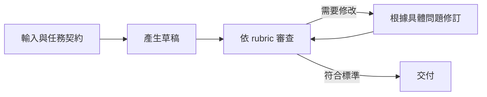
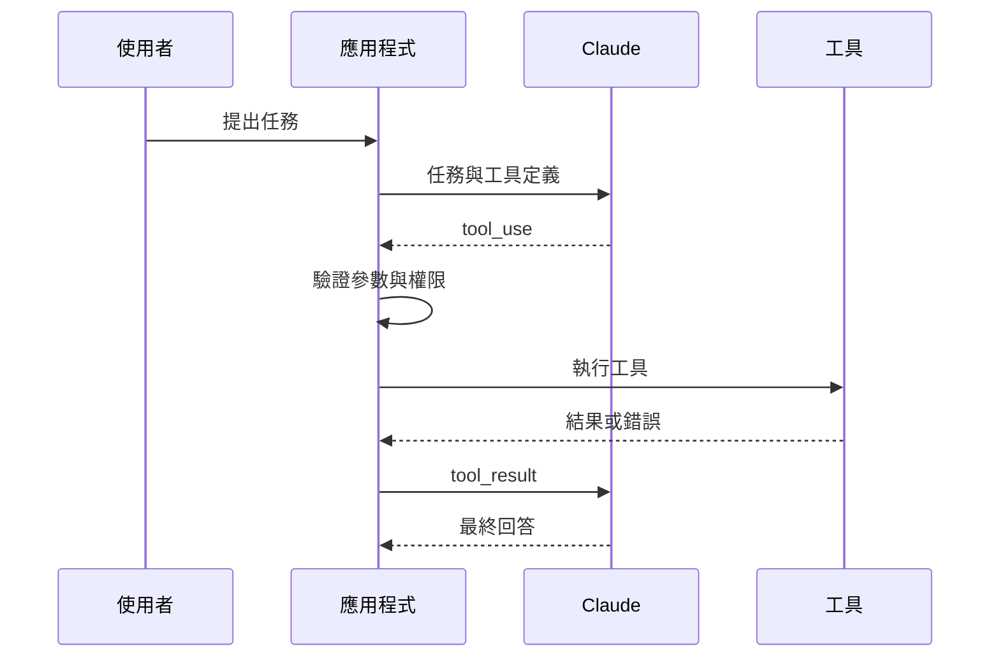

Prompt 愈寫愈長，通常代表一個任務正在吞進太多責任：先搜尋資料、再判斷來源、接著計算、產生草稿、自己審查，最後還要修訂格式。這時繼續增加規則，不一定能提高可靠度，只會讓失敗更難定位。

Anthropic 互動式教程第九章與附錄把前面的技巧組合成複雜 Prompt，接著介紹 prompt chaining、tool use 與 search／retrieval。真正重要的分界不是 Prompt 長度，而是任務是否需要外部能力、可檢查的中間結果或確定性的程式控制。

## 先決定是否真的需要 Workflow

不要因為 Agent 很熱門，就把一次分類變成五個節點。可以用四個問題判斷：

| 情境                                       | 最小選擇          |
| ------------------------------------------ | ----------------- |
| 單一模型呼叫即可完成，結果容易驗證         | 一個 Prompt       |
| 中間產物需要獨立檢查或修訂                 | Prompt chaining   |
| 需要計算、查 API、讀資料庫或產生外部副作用 | Tool use          |
| 答案依賴 Prompt 之外的大量知識             | Search／retrieval |

同一個系統可能同時使用多種方式，但每新增一層都增加 latency、成本、錯誤處理與觀測需求。先停在能通過 evaluation 的最低複雜度。

## Prompt chaining：把生成與核准分開

Prompt chaining 適合有固定步驟，而且每一步都值得檢查的任務。Anthropic 的現行 [Prompting best practices](https://platform.claude.com/docs/en/build-with-claude/prompt-engineering/claude-prompting-best-practices) 仍以「產生草稿、依標準審查、根據審查修訂」作為常見模式。



這個拆法的價值不只是「讓模型再想一次」，而是每輪有不同責任與可觀察輸出。Reviewer 應回傳具體缺口，修訂步驟只處理那些缺口，workflow 也要限制最大循環次數。

## Tool use：模型選擇，應用程式執行

原教程的工具附錄使用 `<function_calls>`、regex 與 `stop_sequences` 手動解析工具請求。那是歷史版本，不應直接移植到新系統。

現行 [Tool use overview](https://platform.claude.com/docs/en/agents-and-tools/tool-use/overview) 將工具分成 client tools 與 server tools。Client tool 的基本流程是：

1. 應用程式把工具名稱、描述與 input schema 傳給 Claude；
2. Claude 回傳 `tool_use` block；
3. 應用程式驗證參數、檢查權限並執行工具；
4. 應用程式以 `tool_result` 把結果送回；
5. Claude 根據真實結果繼續回答。



模型可以建議呼叫哪個工具，不能替應用程式決定是否有權刪除資料、發送訊息或花費資金。不可逆操作的核准與 idempotency 必須留在模型之外。

## Retrieval：把來源帶進來，不是把答案塞進去

當答案依賴文件庫、產品資料或最新資訊時，retrieval 的工作是找出候選來源，保留來源 ID 與必要片段，再讓模型根據這些資料回答。

一條最小 retrieval pipeline 通常包含：

1. 將問題轉成搜尋條件；
2. 取回少量相關文件與 metadata；
3. 要求模型只根據文件回答，並依回應模式附 citation blocks 或結構化來源欄位；
4. 文件不足時拒答或擴大搜尋；
5. 記錄 query、命中文件與最後引用。

不要把整個資料庫塞進 context。檢索品質、切片方式與來源 freshness 都需要獨立 evaluation；模型無法從一份沒被找回來的文件得到正確答案。

若選擇 API 原生 citations，就不要在同一個 request 啟用 `output_config.format`；兩者目前不相容。需要嚴格 JSON 時，改由 schema 定義來源欄位並自行驗證。[Citations 相容性說明](https://platform.claude.com/docs/en/build-with-claude/citations#citations-and-structured-outputs)

## 一個最小可驗證的 Workflow

以「根據內部文件回答技術問題」為例，第一版不需要自由規劃的 Agent：

```yaml
steps:
  - retrieve_documents
  - answer_with_sources
  - validate_source_support
fallback:
  - insufficient_sources
limits:
  max_retrieval_rounds: 2
  max_documents: 8
```

這是流程設定示意，不是特定框架的可執行設定。重點是每個步驟都有固定輸入輸出、明確 fallback 與停止條件。若 evaluation 顯示固定 pipeline 已足夠，就不需要讓模型動態發明新步驟。

## 觀測中間結果，才能知道該修哪裡

一次 workflow 失敗可能來自完全不同的地方：

- 搜尋沒有找到正確文件；
- 工具 schema 讓模型選錯參數；
- 工具執行成功，但回傳內容過於冗長；
- 回答引用了來源，卻推論過度；
- reviewer 的 rubric 太模糊；
- 重試沒有新證據，只是在重複生成。

因此 trace 至少要保存步驟名稱、工具輸入輸出摘要、來源 ID、驗證結果、錯誤類型與停止原因。不要保存或展示模型的私密推理過程；保存能重現行為的外部證據即可。

這也呼應[上一篇 Harness Engineering](/blog/harness-engineering-for-reliable-agents/)的結論：Prompt 描述任務，harness 則負責工具、狀態、權限、驗證與復原。

## 結語：在 Prompt 失去單一責任時停手

單一 Prompt 適合單一、可直接驗證的轉換。當任務需要外部事實、確定性計算、可核准的副作用，或需要獨立檢查中間產物時，就把那些責任移到 workflow。

好的 AI workflow 不是讓模型做更多，而是讓模型只負責最擅長的判斷，其他部分交給可以驗證、可以限制，也可以在失敗時局部重來的系統。
