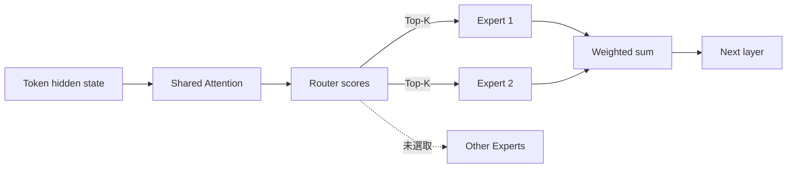

近年的大型語言模型看起來有一個矛盾：總參數持續增加，推論速度與單次成本卻不一定等比例上升。

[@vicky_grok 的長文](https://x.com/vicky_grok/status/2094249057267179839)把答案指向 **Mixture of Experts（MoE）**。這個方向是對的，但要理解 MoE 的工程價值，必須先把三件事分開：模型總共存了多少參數、每個 token 實際啟動多少參數，以及為了調度這些參數付出多少記憶體與通訊成本。

MoE 並不是把八個完整模型排成顧問團，也不是免費把小模型變成大模型。它做的是**條件式運算（conditional computation）**：讓 Router 對每個 token 選出少數 Expert，只執行被選中的分支。

## Dense 與 Sparse 的差別，不只是模型大小

Dense Transformer 會讓每個 token 通過同一組參數。Sparse MoE 則通常保留共享的 Attention，再把部分 Feed-Forward Network（FFN）換成多個 Expert。

以 [Mixtral 8x7B 技術報告](https://arxiv.org/abs/2401.04088)為例，每一層有 8 個 FFN Expert；Router 會為每個 token 選出 2 個，再依權重合併輸出。路由發生在**每個 token、每一層**，不是先判斷整段提示詞屬於數學或歷史，再固定交給某一位專家。



用簡化公式表示，Router 先把 token 的 hidden state `h` 轉成各 Expert 的分數：

```text
logits = W_router · h
selected_logits, selected = top_k(logits, k)
weights = softmax(selected_logits)
output = Σ weights[j] · expert_selected[j](h)
```

這段只是概念表示，不包含容量限制、分散式派送與訓練損失等實作細節。

## Active parameters 才接近單次運算量

MoE 最容易被誤讀的地方，是把「總參數」直接當成「每個 token 的運算量」。

| 模型              | 總參數 | 每個 token 啟動 | 路由方式            |
| ----------------- | -----: | --------------: | ------------------- |
| Mixtral 8x7B      |  46.7B |           12.9B | 8 個 Expert 選 2 個 |
| Grok-1 開放權重版 |   314B |        25% 權重 | 8 個 Expert 選 2 個 |

Mixtral 的數字來自 [Mistral 官方發布說明](https://mistral.ai/news/mixtral-of-experts/)；Grok-1 則由 [xAI 官方發布頁](https://x.ai/news/grok-os)與[開源實作](https://github.com/xai-org/grok-1)公開。

因此，MoE 可以增加模型容量，而不必讓每個 token 跑過全部 Expert。不過「46.7B 總參數、12.9B active」不代表它必然擁有一個 46.7B Dense 模型的品質，也不代表實際延遲一定等同 12.9B Dense 模型。品質仍由訓練資料、架構與訓練方法決定；延遲還會受到記憶體頻寬、batch size、kernel 與跨裝置通訊影響。

## Expert 不是人工指定的學科老師

「Math Expert、History Expert」是好懂的比喻，卻不是標準 MoE 的訓練方式。Router 與 Expert 通常一起由資料學習，開發者不會先替每個 Expert 指派科目。

Mixtral 報告對不同語料的路由分析沒有觀察到明確的主題分工；某些 token 的路由模式更接近語法結構。這不表示所有 MoE 都不會形成語意或領域專門化，而是不能只看到 Expert 這個名字，就假設模型內部已經存在可讀的部門組織圖。

對工程師更實用的理解是：Expert 是一組可被 Router 稀疏選取的 FFN 參數。它學到什麼，要靠路由統計與實驗驗證，不能靠命名推斷。

## 省下 FLOPs，沒有省掉全部成本

### 1. 權重仍要放進記憶體

即使一次只啟動兩個 Expert，低延遲推論通常仍要讓所有 Expert 的權重保持可存取。以 BF16 的 2 bytes 粗估，Mixtral 的 46.7B 參數光權重就接近 93.4 GB；[Mistral 文件](https://docs.mistral.ai/models/mixtral-8x7b-0-1)列出的近似 GPU 記憶體需求是 94 GB，還未替所有執行時開銷保留空間。

[量化與 offloading](https://arxiv.org/abs/2312.17238)可以降低 GPU 記憶體門檻，但 offloading 會增加權重搬移。這是容量、延遲與硬體成本之間的交換，不是把未啟動 Expert 變成零成本。

### 2. Router 必須避免流量塞進少數 Expert

若大量 token 都被送到相同 Expert，其他 Expert 閒置，熱門 Expert 卻成為瓶頸。2017 年的 [Sparsely-Gated MoE 論文](https://arxiv.org/abs/1701.06538)與後來的 [Switch Transformer](https://arxiv.org/abs/2101.03961)都把負載平衡與訓練穩定性列為核心問題。

部分訓練系統會為 Expert 設定 capacity；超量 token 可能被丟棄、旁路或重新路由。但 token dropping 是特定路由與容量策略的行為，不是所有 MoE 推論必然會發生，更不能直接推論成「一 dropping 就會 hallucinate」。

### 3. 多 GPU 會增加派送與回收成本

Expert 分散在不同裝置時，系統要先把 token 派到對應裝置，再把輸出收回。[Switch Transformer](https://arxiv.org/abs/2101.03961)也把通訊成本列為 MoE 的採用障礙；省下矩陣乘法，不代表同時省下網路傳輸。

## 選 MoE 模型時，該看哪些數字？

如果只是呼叫模型 API，總參數與 Expert 數量通常不是決策重點。直接比較同一工作負載下的品質、首 token 延遲、輸出速度與價格即可。

若要自行部署，至少同時檢查四項：

1. **總權重大小**：決定顯存、量化或 offloading 需求；
2. **Active parameters 與 Top-K**：接近每個 token 的主要 FFN 運算量；
3. **Expert 分布**：觀察負載不均與尾端延遲，而不只看平均 tokens/s；
4. **裝置拓樸**：確認 Expert parallelism 的跨卡通訊是否吃掉稀疏運算省下的時間。

MoE 的真正價值，不是「用小模型成本免費獲得大模型智慧」，而是把模型容量與單次運算量拆成兩個可分別設計的旋鈕。Router 讓系統只啟動當下需要的一部分參數；工程代價則轉移到記憶體、負載平衡與通訊。看懂這三筆帳，才知道 MoE 在自己的工作負載上究竟是加速，還是只把成本搬了位置。
