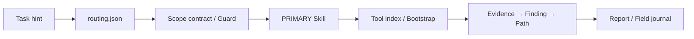

看到 `reverse-skill` 收錄 APK、IDA、Frida、Burp、CTF、韌體與滲透測試模組，很容易把它理解成「裝上後，AI 就會自動完成逆向」。但從原始碼看，它真正解決的不是分析能力，而是工作流失控：Agent 不知道該選哪套方法、工具散落在不同機器、結論沒有證據鏈，同一個坑又在下一次任務重踩。

因此 `reverse-skill` 比較準確的定位是資安 Skill router pack。它把任務路由、授權範圍、工具能力、操作紀錄與經驗回寫放進同一套檔案契約，讓 Claude Code、Codex、Cursor 等 coding agent 能沿著相同流程工作，而不是各自猜一串命令。[專案 README 的定位與主流程](https://github.com/zhaoxuya520/reverse-skill/blob/71acc8e3115f76bad7a914c36466c1086232288c/README.md#L52-L60)、[client-neutral integration](https://github.com/zhaoxuya520/reverse-skill/blob/71acc8e3115f76bad7a914c36466c1086232288c/README.md#L243-L245)

本文以 2026-08-31 的 commit [`71acc8e`](https://github.com/zhaoxuya520/reverse-skill/commit/71acc8e3115f76bad7a914c36466c1086232288c) 為分析基準。所有「支援」指專案在該版本提供的 route、Skill 或 bootstrap 定義，不等於每個工具都已在本機安裝，也不代表每項安全結論會自動成立。

## 主幹不是工具清單，而是六段資料流

整套流程可以縮成六步：



這六步處理的是不同問題：router 決定從哪裡開始，scope 記錄操作者宣告的授權與範圍，Skill 提供方法，tool index 確認本機能力，Evidence chain 分開觀察與結論，journal 才把可重用經驗帶到下一個 case。

## 路由靠規則比對，不靠模型再猜一次

路由的 single source of truth 是 [`skills/config/routing.json`](https://github.com/zhaoxuya520/reverse-skill/blob/71acc8e3115f76bad7a914c36466c1086232288c/skills/config/routing.json)。分析版本共有 43 條 route，涵蓋 APK、iOS、JS、二進位、惡意程式、API、雲端、供應鏈、LLM 安全與其他情境。

Bash router 的做法很直接：把使用者的 task hint 轉成小寫，以 regex `must`、`mustAll` 與 `exclude` 檢查各規則；命中一次就加一分，再依 priority 選最高分 route。完全沒有強關鍵字時回退 R0 通用逆向。[`master-route.sh` 的計分與選路](https://github.com/zhaoxuya520/reverse-skill/blob/71acc8e3115f76bad7a914c36466c1086232288c/skills/scripts/master-route.sh#L74-L120)

這個設計看似不夠「AI」，卻很適合工程控制：相同輸入可以得到相同 PRIMARY Skill，也能留下 regression cases。代價是 regex 只看文字，不理解檔案內容、環境與真實意圖；路由結果是入口，不是分析結論。

Router 會把 PRIMARY、信心、secondary routes 與下一個應讀的 Skill 寫進 caller project 的 `work/master-route-<timestamp>/route-scope.md`。這一步已經開始收集狀態；依專案流程契約，此時還不應對目標掃描或利用。

## Scope contract 把「點名目標」和「宣告授權」分開

執行前的流程契約由 `case-init` 建立。它會產生：

```text
work/<case>/
  scope.md
  timeline.md
  workitems.md
  evidence/
  notes/
  report/
```

只有 `auth.status=granted`，並且 network profile、in-scope asset 或明確 offline sample 滿足條件時，`scope.md` 才會得到 `ready_for_act=true`。另行執行 `case-guard.sh` 時，相容參數 `--force` 也不能繞過這些欄位檢查。[`case-init.sh` 的 ready 判斷](https://github.com/zhaoxuya520/reverse-skill/blob/71acc8e3115f76bad7a914c36466c1086232288c/skills/scripts/case-init.sh#L208-L215)、[`case-guard.sh`](https://github.com/zhaoxuya520/reverse-skill/blob/71acc8e3115f76bad7a914c36466c1086232288c/skills/scripts/case-guard.sh#L67-L126)

但這不是外部授權驗證，也不會攔截所有工具呼叫。`--auth-granted`／`--auth-status granted` 與 `evidence_of_auth` 都由 caller 提供；production scripts 不會在每次動作前自動執行 guard。[`case-init.sh` 的授權欄位來源](https://github.com/zhaoxuya520/reverse-skill/blob/71acc8e3115f76bad7a914c36466c1086232288c/skills/scripts/case-init.sh#L129-L145) 它的安全效果依賴 Agent／操作者遵守契約，或由 host 在外層強制呼叫 guard 並限制工具權限。

這層仍然重要，因為它至少要求把「使用者提供了一個 URL」和「操作者宣告已取得授權」分成不同欄位。`offline`、`lab_only`、`authorized_target_only` 與 `unrestricted_lab` 把預期的網路邊界明寫進 case；真正的 network enforcement 仍要由 sandbox、firewall 或工具權限提供。

## 收集的是可回放狀態，處理的是證據關係

Case 開始後，`timeline.md` 只追加 transition，不改寫舊紀錄；`workitems.md` 保存工作項目與覆蓋狀態。沒有變動的 route、scope 或既有 Evidence 不會每輪重抄，而是用 `carry_forward_refs` 指回權威檔案。[timeline 與 workitem 契約](https://github.com/zhaoxuya520/reverse-skill/blob/71acc8e3115f76bad7a914c36466c1086232288c/skills/ops/timeline-workitem.md)

分析資料再分成三層：

| 層級     | 保存內容                               | 避免的錯誤                     |
| -------- | -------------------------------------- | ------------------------------ |
| Evidence | 來源、時間、hash、重現命令、原始摘錄   | 把推測寫成觀察                 |
| Finding  | 嚴重度、位置、影響、信心、Evidence IDs | 沒有證據就宣布漏洞成立         |
| Path     | 攻擊、呼叫或解題步驟                   | 只有零散發現，無法交接完整路徑 |

Finding 至少要引用一項 Evidence；若標成 `validated`，契約建議使用兩項獨立證據，例如一項靜態、一項動態。最後可用 `review_case.py --verify-hashes --strict` 檢查 scope 欄位、引用關係與 artifact hash。[Evidence→Finding→Path 契約](https://github.com/zhaoxuya520/reverse-skill/blob/71acc8e3115f76bad7a914c36466c1086232288c/skills/ops/evidence-finding-path.md)

不過這仍然是 Markdown 加 hash 的輕量方案。Hash 只能檢查目前 artifact 是否符合目前紀錄的值；artifact 與 Markdown hash 欄位可以一起被修改，因此不能證明歷史未被竄改，也不能證明最初取得資料的方式合法或原始觀察正確。人或獨立 reviewer 仍要檢查取得過程與推論。

## Tool index 與 bootstrap 是兩個不同權限層

[`refresh-tool-index.sh`](https://github.com/zhaoxuya520/reverse-skill/blob/71acc8e3115f76bad7a914c36466c1086232288c/skills/scripts/refresh-tool-index.sh#L1-L16) 不安裝工具，但不只是讀 command、路徑與版本。它也會讀 Claude／Codex 的 MCP 設定、探測 manifest 登記的 localhost port，並對已開啟的本機 MCP endpoint 發送 `tools/list` HTTP POST，再產生 capability status。[MCP 與 localhost 探測](https://github.com/zhaoxuya520/reverse-skill/blob/71acc8e3115f76bad7a914c36466c1086232288c/skills/scripts/refresh-tool-index.sh#L227-L344) 這讓 Agent 先回答「目前有哪些工具與服務可用」，再決定是否真的需要改變環境；執行前也應知道它會讀取 client 設定並對 localhost 服務送出請求。

缺工具時才進入 bootstrap manifest。裡面可以看到幾種供應鏈策略：jadx 與 apktool 固定 release 與 SHA-256；Frida 固定 Python package 版本；anything-analyzer 固定 Git commit；商業軟體 JEB Pro 只給合法安裝指引，不代為下載。[`bootstrap-manifest.json`](https://github.com/zhaoxuya520/reverse-skill/blob/71acc8e3115f76bad7a914c36466c1086232288c/skills/scripts/bootstrap-manifest.json#L11-L176)

但不能因此把 bootstrap 當成無副作用的 setup。它可能安裝套件、clone repository、啟動 localhost 服務，明確指定 host 時也會註冊 MCP。預設 `--mcp-host=none` 是合理護欄；供應鏈 pin 也不是全面固定，例如 radare2 使用 GitHub API 的動態 digest，ADB 使用 `winget-latest`。[bootstrap 參數與安全路徑檢查](https://github.com/zhaoxuya520/reverse-skill/blob/71acc8e3115f76bad7a914c36466c1086232288c/skills/scripts/bootstrap-reverse.sh#L1-L32)、[manifest 的動態項目](https://github.com/zhaoxuya520/reverse-skill/blob/71acc8e3115f76bad7a914c36466c1086232288c/skills/scripts/bootstrap-manifest.json#L177-L209)

實務上應先 review manifest 與安裝腳本，再只 bootstrap 當前 PRIMARY Skill 缺少的 capability；不要因為工具清單很長，就一次把全部裝進工作機。

## 「自動進化」其實是脫敏 journal

專案把每次完成後的經驗寫進 `skills/field-journal/`。Template 要求記錄脫敏 scope、完整執行鏈、最多三項 Evidence、核心 Finding／Path、踩坑、工具版本與可重用模式，最後同步索引。[field journal template](https://github.com/zhaoxuya520/reverse-skill/blob/71acc8e3115f76bad7a914c36466c1086232288c/skills/field-journal/_template.md)

所以「self-evolving knowledge base」不是模型自動訓練，也不會自行調整權重。它是 repository 內的案例庫：下次任務先搜尋 journal，命中相似情境再重用已驗證流程。這種做法簡單、可 diff，也更容易刪改；相對地，公開回寫前的脫敏品質會直接成為資料外洩邊界。

## 本機實測：路由通過，Bash workflow 暴露 macOS 相容問題

我在 macOS 26.5.1、Bash 3.2.57、Python 3.9.6 上執行 repository 內建測試：

```text
bash skills/scripts/test-routing.sh
TOTAL=173 PASS=173 FAIL=0
OVERALL: ALL PASS (173 routing cases + default-root regression)
```

這證明分析 commit 的 Bash router 能通過 173 個既有 hint→PRIMARY 案例，也能把預設產物寫到 caller project。

另一個 `test-bash-workflow.sh` 則只通過 case 建立與有效 scope gate，第三項 fixture 就失敗。原因不是 gate 接受了錯誤設定，而是測試用 GNU `sed -i` 語法改檔；macOS 的 BSD `sed` 需要不同參數。[失敗位置](https://github.com/zhaoxuya520/reverse-skill/blob/71acc8e3115f76bad7a914c36466c1086232288c/skills/scripts/test-bash-workflow.sh#L29-L47)

因此可以說「Bash 路由案例在這台 macOS 全數通過」，不能把結論擴張成「整套 macOS workflow 已驗證」。主 CI 的完整 Bash workflow test 跑在 Ubuntu；另一個 macOS compatibility job 會解析所有 shell scripts，並實際走過 router、case-init 與 case-guard，但沒有呼叫發生錯誤的 `test-bash-workflow.sh`。[主 CI 的 Bash checks](https://github.com/zhaoxuya520/reverse-skill/blob/71acc8e3115f76bad7a914c36466c1086232288c/.github/workflows/ci.yml#L145-L190)、[macOS compatibility workflow](https://github.com/zhaoxuya520/reverse-skill/blob/71acc8e3115f76bad7a914c36466c1086232288c/.github/workflows/macos-bash-compat.yml) 這正好說明跨平台文件、跨平台入口與跨平台測試是三件不同的事。

## 值得借走的是控制面，不是整包照搬

如果團隊已有自己的 Agent Skills，未必要引入全部 offensive security 模組。最有價值、也最容易移植的是四個邊界：

1. 用 deterministic config 路由重複任務，留下 regression cases；
2. 在有副作用前，把授權、目標與網路範圍做成可檢查契約，並由 host 強制執行；
3. 分開 Evidence、Finding 與 Path，不讓結論失去來源；
4. 將工具偵測和工具安裝拆成不同動作，安裝預設不修改 client global config。

這四層不能讓 Agent 自動變成資安專家，但能讓它比較難跳步、比較容易被 review，也能在任務失敗時只重跑出問題的那一段。

`reverse-skill` 本身也明定只供合法安全研究、教育、CTF、自有或明確授權的系統；未授權掃描、利用與資料取得都被禁止。[專案使用限制](https://github.com/zhaoxuya520/reverse-skill/blob/71acc8e3115f76bad7a914c36466c1086232288c/README.md#L319-L323) 對這類框架而言，scope contract 不能只停在 Markdown；若要形成真正的安全邊界，host 還必須把 guard 接到工具權限與網路限制前。
